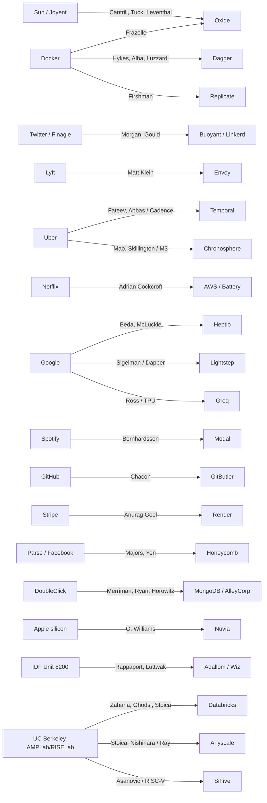
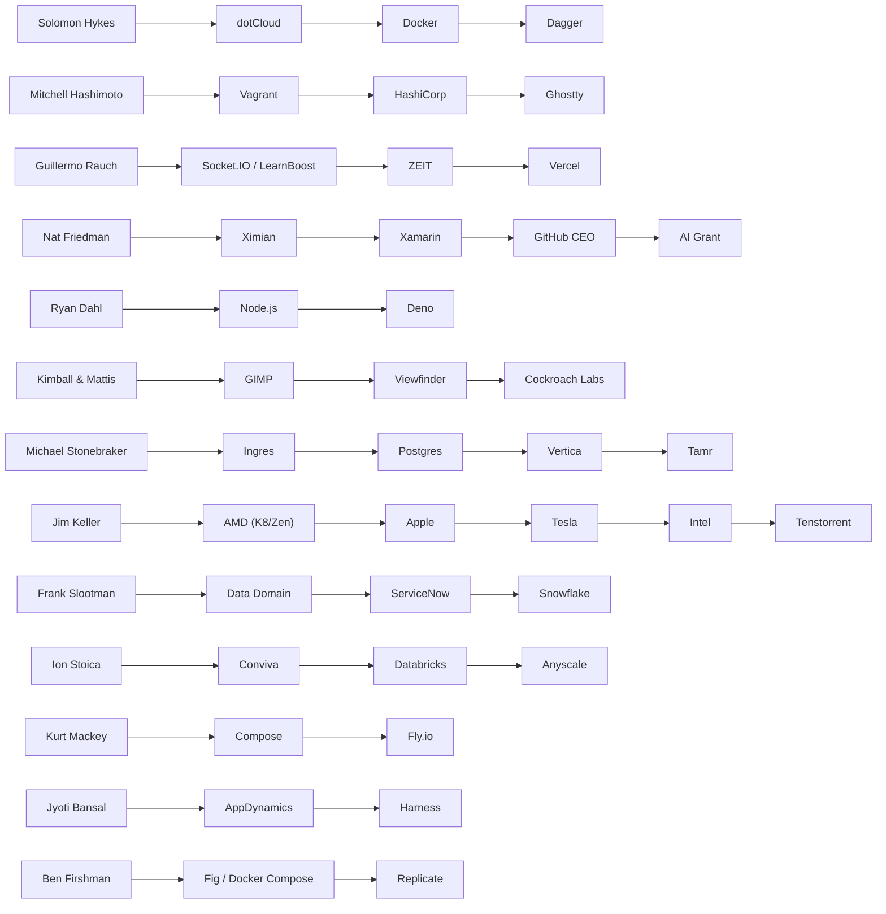
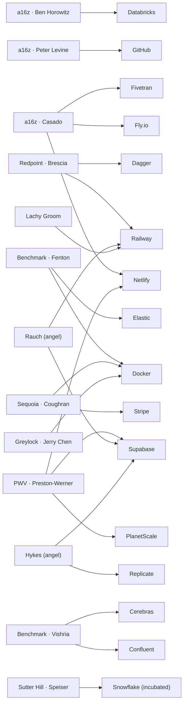
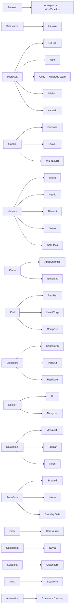

# Nested Virtualization & the Platforms Built on the Public Clouds — A Chronological, Sourced Report

> **What this is.** It began as a timeline of when major cloud providers enabled (or declined to enable) *nested virtualization* — running a hypervisor/VMs *inside* a cloud VM — and the debate over whether AWS's long delay was **technical** or **anti-competitive**. It now also carries a broader **[extended timeline of the platforms built on top of the public clouds](#extended-timeline-platforms-built-on-the-public-clouds)** — PaaS, CI/CD & runners, containers/orchestration/IaC, serverless/edge/WASM, data & ML platforms, internal developer platforms, and cloud dev environments — with their **key people** and dated milestones. Nested virtualization is the originating thread; the platform ecosystem it sits within is the wider story.
>
> **Provenance rules used here.** Every factual claim is tied to an actual URL that was checked to resolve. Each URL in the [Source ledger](#source-ledger-every-url-verified-2026-06-01) was fetched or HTTP-verified on **2026-06-01**; status is noted. Where a publisher blocks crawlers (HTTP 403), an Internet Archive (Wayback) snapshot is provided as the user requested. Community opinions (Hacker News / Reddit comments) are quoted verbatim and **clearly labeled as opinion, not fact.**
>
> **Honest limitation up front.** Across all *primary* sources (vendor docs, vendor announcements) the documented reasons are **technical** (hypervisor not exposing CPU virtualization extensions, hardware/security isolation, performance overhead). **No primary or authoritative source found in this research substantiates the "anti-competitive" theory as fact.** That theory exists only as *community speculation* in forum comments, presented as such in the [Debate](#the-technical-vs-anti-competitive-debate) section.

---

## Contents

**Part I — Nested virtualization (the origin question)**
- [Executive summary](#executive-summary) · [Background: why a provider must choose](#background-why-a-provider-must-choose-to-enable-it) · [Chronological timeline](#chronological-timeline) · [Current provider status](#current-provider-status-as-of-june-2026) · [Companies built on the technology](#companies-and-products-built-on-this-technology) · [The technical-vs-anti-competitive debate](#the-technical-vs-anti-competitive-debate)

**Part II — The wider platform ecosystem**
- [Extended timeline (platforms on the public clouds)](#extended-timeline-platforms-built-on-the-public-clouds)
- [Connection graph (visual)](#connection-graph-visual) — Mermaid diagrams of the spine
- [Founder lineages](#founder-lineages--where-the-key-people-came-from)
- [Connections & talent networks](#connections--talent-networks) — mafias, the VMware/Nicira/a16z web, Berkeley AMPLab, data-infra/observability/config mafias, the AI-infra & GPU-cloud layer, VC board interlocks, Rails lineage, cloud-native networking, the Postgres-from-Berkeley lineage, CDN→edge, the modern data stack, and the [acquisition graph](#the-acquisition-graph-chronological)
- [Major product launches](#major-product-launches-chronological)
- [Funding, valuations & IPOs](#funding-valuations--ipos)
- [Key-people moves, departures & acquisitions](#key-people-moves-founder-departures--major-acquisitions)
- [Viral Hacker News threads & controversies](#viral-hacker-news-threads--controversies)
- [The open-source licensing wars](#the-open-source-licensing-wars-rug-pulls)

**Part III — Reference**
- [People & company index](#people--company-index) — alphabetical
- [Source ledger](#source-ledger-every-url-verified-2026-06-01) — every URL, verified
- [Caveats, gaps & unverified items](#caveats-gaps-and-unverified-items)

---

## Executive summary

- **Nested virtualization is not "on" by default anywhere.** On a normal cloud VM the host hypervisor (L0) does not advertise the CPU's hardware-virtualization extensions (Intel VT-x / AMD-V) to the guest, so the guest cannot itself act as a hardware-accelerated hypervisor. A provider must *deliberately* pass those extensions through. ([Intel/Nakajima 2013](#s-nakajima), [Proxmox wiki](#s-proxmox))
- **Microsoft Azure** enabled it first among the big three — **13–14 July 2017** — leveraging Hyper-V's built-in nested support. ([Azure blog](#s-azure-blog), [The Register 2017](#s-reg-2017))
- **Google Cloud (Compute Engine)** followed **28 September 2017**, adding Intel VT-x to VMs on Haswell-or-newer Intel CPUs (Linux/KVM only). ([GCP blog](#s-gcp-blog), [GCP docs](#s-gcp-overview))
- **AWS EC2** historically did **not** support it on ordinary instances; the **Nitro hypervisor is lightweight and did not expose VT-x to guests**, so the documented workaround was **bare-metal Nitro instances**. ([AWS Nitro instances doc](#s-nitro-instances), [AWS bare-metal launch blog 2017](#s-baremetal-blog))
- A parallel AWS bet — **Firecracker** microVMs (Nov 2018) — shows AWS's actual virtualization strategy was *lightweight isolation for serverless*, not nesting; it became the substrate for a wave of startups. ([Firecracker blog](#s-firecracker-blog), [HN 2018](#s-hn-firecracker))
- **AWS finally enabled nesting on *virtual* (non-bare-metal) instances on 16 February 2026** — on C8i/M8i/R8i, all commercial regions, KVM/Hyper-V as the inner (L1) hypervisor; Graviton/ARM not supported. ([AWS What's New](#s-aws-whatsnew), [AWS User Guide](#s-aws-userguide), [The Register 2026](#s-reg-2026), [InfoQ](#s-infoq))
- **Smaller providers** vary: **Oracle OCI** supports it on Intel VM shapes; **DigitalOcean** says it is *not a supported feature* and discourages it; **Hetzner** supports it on bare-metal dedicated servers (not the cloud VPS layer).
- **An ecosystem of companies** now monetizes this: microVM platforms (**Fly.io, E2B, Modal**), bare-metal CI (**Blacksmith, Depot, Namespace, WarpBuild**), "open cloud on bare metal" (**Ubicloud**), VM-isolated containers (**Kata, gVisor, Sysbox/Docker, KubeVirt**), and on-prem clouds (**Oxide, Equinix Metal**). See [Companies](#companies-and-products-built-on-this-technology).
- **Verdict on the core question:** the documented record supports a **technical** explanation for AWS's delay. The **anti-competitive** framing is a *recurring community opinion* but is **not** supported by any primary source located here. ([HN Feb 2026](#s-hn-2026))

---

## Background: why a provider must *choose* to enable it

Nested virtualization means an L1 guest VM runs its own L2 VMs with hardware acceleration. This only works if the L0 hypervisor exposes virtual VT-x / VMCS / EPT to the L1 guest.

- Intel engineer **Kotaro Nakajima**, LinuxCon Japan (**28 May 2013**): on cloud Compute Nodes "H/W Virtualization features are **not** available for guests" / "No H/W Virtualization features advertised," and defined nested virtualization as a "**software feature in (Root) VMM that allows Guest VMM to use H/W virtualization features**." Without it: "No KVM on Linux, No Hyper-V functionality on Windows, No HVM on Xen … Need to use software emulation – Very slow." — https://events.static.linuxfound.org/sites/events/files/cojp13_nakajima.pdf ([ledger](#s-nakajima))
- The **Proxmox** wiki corroborates the performance stakes: without KVM hardware virtualization a nested guest is "10x slower or more." — https://pve.proxmox.com/wiki/Nested_Virtualization ([ledger](#s-proxmox))

Support is therefore a deliberate engineering decision, not a default — the fact that frames the entire timeline.

---

## Chronological timeline

### 28 May 2013 — Technical groundwork is publicly explained
Intel's Nakajima lays out, at LinuxCon Japan, why cloud guests can't nest unless the host VMM explicitly virtualizes VT-x — and that the fallback (software emulation) is "very slow."
→ https://events.static.linuxfound.org/sites/events/files/cojp13_nakajima.pdf ([ledger](#s-nakajima))

### 2 November 2016 — DigitalOcean: "not a planned or supported feature"
DigitalOcean employee **Ryan Quinn**, on the community Q&A:
> "It may be possible but it is not a planned or supported feature. In general nested virtualization provides poor performance and is not recommended."

An early *provider* statement framing the limit as **performance**, not policy.
→ https://www.digitalocean.com/community/questions/does-digitalocean-support-nested-kvm-now ([ledger](#s-do-q))

### January 2017 — KubeVirt begins at Red Hat
Red Hat starts KubeVirt, letting VMs (libvirt/QEMU/KVM) run as native Kubernetes objects — an early sign that "VMs inside container platforms" would become a product category. (Accepted to CNCF 2019-09-06; Incubating 2022-04-19; v1.0 2023-07.)
→ https://www.cncf.io/projects/kubevirt/ ([ledger](#s-kubevirt))

### 13–14 July 2017 — Microsoft Azure enables nested virtualization (first of the big three)
> "Today we are excited to announce that you can now enable nested virtualization using the Dv3 and Ev3 VM sizes … We will continue to expand support to more VM sizes in the coming months."

Works because Azure runs **Hyper-V** (built-in nesting, no extra hypervisor licensing). *The Register* (14 Jul 2017) reported the move "enabled nested virtualization for the first time."
*Discussion note:* I found **no quotable HN/Reddit thread dedicated to the Azure launch** — the announcement is later cited inside the 2018 r/aws thread below.
→ https://azure.microsoft.com/en-us/blog/nested-virtualization-in-azure/ ([ledger](#s-azure-blog)) · https://www.theregister.com/2017/07/14/microsoft_adds_nested_virtualization_to_azure/ ([ledger](#s-reg-2017)) · https://learn.microsoft.com/en-us/windows-server/virtualization/hyper-v/nested-virtualization ([ledger](#s-ms-learn))

### 28 September 2017 — Google Cloud (Compute Engine) enables nested virtualization
> "[Nested virtualization] enables you to run one or more virtual machines inside a Compute Engine Linux virtual machine — VMs inside of VMs. This leverages Intel VT-x … to deliver better performance than … emulation."

Works on "an Intel's Haswell CPU or newer." Current docs: enabled via the `enableNestedVirtualization` field; Intel-only (no AMD/Arm); Linux KVM as L1.
*Discussion note:* The HN submissions for this launch (e.g. [id 15360422](https://news.ycombinator.com/item?id=15360422), 2017-09-28) **received 0 comments** — there is no community thread to quote. (The GCE engineer who built it later surfaced in the 2026 AWS thread; see below.)
→ https://cloudplatform.googleblog.com/2017/09/introducing-nested-virtualization-for.html ([ledger](#s-gcp-googleblog)) · https://cloud.google.com/blog/products/gcp/introducing-nested-virtualization-for ([ledger](#s-gcp-blog)) · https://cloud.google.com/compute/docs/instances/nested-virtualization/overview ([ledger](#s-gcp-overview)) · https://cloud.google.com/compute/docs/instances/nested-virtualization/enabling ([ledger](#s-gcp-enabling))

### December 2017 — Kata Containers launches
The OpenStack/OpenInfra Foundation launches **Kata Containers** (merging Intel Clear Containers + Hyper.sh runV): each container runs inside a lightweight VM, combining container UX with VM hardware isolation. A foundational "VM-isolated container" product.
→ https://katacontainers.io/ ([ledger](#s-kata))

### 28 November 2017 — AWS launches EC2 *bare-metal* instances (the workaround takes shape)
AWS's bare-metal launch blog (Jeff Barr) frames the use case in terms that bear directly on nesting — customers "wanted access to the physical resources for applications that take advantage of low-level hardware features such as performance counters and **Intel® VT that are not always available or fully supported in virtualized environments**." This established AWS's long-standing answer to "how do I nest?": *use bare metal* (which also enabled **VMware Cloud on AWS** to run ESXi).
→ https://aws.amazon.com/blogs/aws/new-amazon-ec2-bare-metal-instances-with-direct-access-to-hardware/ ([ledger](#s-baremetal-blog)) · https://aws.amazon.com/vmware/ ([ledger](#s-aws-vmware))

### 29–30 November 2017 — Brendan Gregg documents Nitro; HN debates (technically)
Gregg's write-up: Nitro is a KVM-core-based, lightweight hypervisor with sub-1% overhead. The HN thread that follows ("AWS EC2 Virtualization 2017: Including Nitro", submitted 2017-11-30) is **technical**, not commercial:
- **andrewstuart:** "Does this allow nested virtualization? ie the ability to run VMs within an EC2 instance?"
- **aliguori:** "C5 does not support nested virtualization but **i3.metal allows using virtualization technology** without nested virtualization."
- **gregdunn:** "`*.metal` instances utilize most of the Nitro technology stack, but **not the Nitro hypervisor.**"
→ https://www.brendangregg.com/blog/2017-11-29/aws-ec2-virtualization-2017.html ([ledger](#s-gregg)) · https://news.ycombinator.com/item?id=15813779 ([ledger](#s-hn-2017))

### 29 January 2018 — The canonical Reddit demand thread (r/aws)
"Can EC2 support nested virtualization?" became the long-cited record of pent-up demand and the technical-vs-cost friction. (Live page 403s to crawlers; recovered via Wayback.)
- **IIGrudge (OP):** "In Azure, I can run KVM in my virtual machine, a technique known as nested virtualization. Has Amazon made any progress in allowing HyperV/VMware/KVM in EC2? Update: Seems like the consensus is **NOT YET**. FYI Google Cloud supports nesting … I was able to migrate my VM and test that running KVM works on GCE."
- **Quinnypig (Corey Quinn):** "It can, depending upon use case and instance type. **EC2 Bare Metal lets you do a lot** … That said — what's the use case?"
- **IIGrudge:** "The use case is to create a training platform. Right now we use Ravello, which is a proprietary hypervisor on the cloud. We're trying to move away from it because **Oracle bought them out and we don't like how much they charge** … This works beautifully on Azure."
- **Dr-Xperience:** "I need to run QEMU-KVM on our client aws cloud … **this have worked on Oracle Cloud and Azure, but I have still not been able to get it work on AWS.** My client might not be able to afford bare-metal."
- **bradynapier:** "Also interested in this as we are attempting to roll out **Kata Containers via Kubernetes/EKS**. Was really sad to see no nested virtualization."
→ Wayback (live 403): http://web.archive.org/web/20230610053315/https://old.reddit.com/r/aws/comments/7twr36/can_ec2_support_nested_virtualization/ ([ledger](#s-reddit-2018))

### May 2018 — Google open-sources gVisor; EC2 bare metal goes GA
- **gVisor** (announced at KubeCon Copenhagen, May 2018): a user-space "application kernel" (`runsc`) that sandboxes containers by intercepting syscalls — isolation without a full VM. Later used by GKE Sandbox and Modal.
- **i3.metal** reaches GA (re:Invent 2017 preview → May 2018), cementing bare metal as the AWS nesting path.
→ https://cloud.google.com/blog/products/identity-security/open-sourcing-gvisor-a-sandboxed-container-runtime ([ledger](#s-gvisor)) · https://github.com/google/gvisor ([ledger](#s-gvisor-repo))

### 26–27 November 2018 — AWS open-sources Firecracker; HN debate turns explicitly to motives
AWS releases **Firecracker**, a minimal KVM-based VMM for microVMs (powers Lambda/Fargate; ~125 ms boot, <5 MiB overhead). The HN thread (2018-11-27, 368 pts) is where the **technical-vs-anti-competitive** argument first appears in force:
- **fapjacks (anti-competitive/lock-in opinion):** "In the end, AWS saw containerization as an existential threat, and serverless is its response to the commoditization of AWS … Serverless helps AWS re-couple your application back into the specialized AWS vendor environment …"
- **ex-aws-now-goog (rebuttal):** "Having worked at AWS, I have to disagree … **No-one that I worked with saw containerization as a threat.** … All the big cloud providers provide serverless features and it never takes long to see feature parity."
- **dm3 (commercial reading):** "Pushing the adoption of 'serverless' — benefits Amazon ultimately as it's the largest provider."
- **aliguori (AWS engineer, technical):** "Kata Containers … uses QEMU to run the actual VMs. **Firecracker just replaces the QEMU part** … We wanted to explore something really focused on serverless."
→ https://aws.amazon.com/blogs/aws/firecracker-lightweight-virtualization-for-serverless-computing/ ([ledger](#s-firecracker-blog)) · https://github.com/firecracker-microvm/firecracker ([ledger](#s-firecracker-repo)) · https://news.ycombinator.com/item?id=18539539 ([ledger](#s-hn-firecracker)) · AWS What's New: https://aws.amazon.com/about-aws/whats-new/2018/11/firecracker-lightweight-virtualization-for-serverless-computing/ ([ledger](#s-firecracker-whatsnew))

### 18 September 2020 — AWS "Reinventing virtualization with the AWS Nitro System"; HN discusses
AWS's essay (allthingsdistributed) is discussed on HN (submitted 2020-09-18). Comments again point to **security/architecture**:
- **khuey:** "Moving the hypervisor off the main CPU has made Amazon more comfortable (from a **security perspective**) enabling 'bare metal' features like hardware performance counters."
- **_msw_** ("I work at Amazon on building infrastructure for AWS"): "For the bare metal instance configurations … **there is no hypervisor running on the processor.**"
- **wmf:** "Yes, Nitro is built on KVM, but KVM is a very small component."
→ https://www.allthingsdistributed.com/2020/09/reinventing-virtualization-with-aws-nitro.html ([ledger](#s-nitro-essay)) · https://news.ycombinator.com/item?id=24515019 ([ledger](#s-hn-2020))

### March 2020 — Equinix acquires Packet → Equinix Metal
Equinix buys bare-metal-as-a-service pioneer **Packet** (~$335M), rebranding it Equinix Metal — single-tenant bare metal on which customers run their own hypervisor/virtualization stack.
→ https://investor.equinix.com/news-events/press-releases/detail/115/equinix-completes-acquisition-of-bare-metal-leader-packet ([ledger](#s-equinix))

### 20 July 2022 — HN: Nitro "bare metal" debate resurfaces
On an HN discussion (submitted 2022-07-20), engineers debate whether Nitro "bare metal" truly has no hypervisor:
- **pclmulqdq:** "The metal versions use the Nitro card, but run all of the virtualization on the Nitro card, so there is **no hypervisor running on the machine** … There are no hypercalls and there is no hypervisor software on machines with this type of virtualization."
- **mcspiff:** "Your operating system is running directly on the CPU, same as regular bare metal servers."
→ https://news.ycombinator.com/item?id=32165846 ([ledger](#s-hn-2022))

### 10 May 2022 — Docker acquires Nestybox (Sysbox)
Docker acquires **Nestybox**, whose open-source **Sysbox** runtime lets unprivileged containers run systemd, Docker-in-Docker, Kubernetes, even KVM — "like VMs." A "nested isolation without privileged containers" product folded into Docker.
→ https://www.docker.com/blog/docker-advances-container-isolation-and-workloads-with-acquisition-of-nestybox/ ([ledger](#s-nestybox)) · https://github.com/nestybox/sysbox ([ledger](#s-sysbox-repo))

### 2023 — Oxide ships; the on-prem-cloud category matures
**Oxide Computer** (founded 2019-09) unveils its commercial rack-scale "cloud computer" — integrated hardware + its own hypervisor + control plane — for organizations that want hyperscaler-style cloud on-prem.
→ https://oxide.computer/blog/oxide-unveils-the-worlds-first-commercial-cloud-computer ([ledger](#s-oxide-blog)) · https://oxide.computer/ ([ledger](#s-oxide))

### ~2024 — Oracle Cloud (OCI) documents nested KVM as supported on Intel shapes
Oracle publishes hands-on guides for nested KVM on OCI. OCI docs indicate support on **Intel VM shapes** (e.g. `VM.Standard3.Flex`); **Ampere (ARM) shapes do not** support it. (Live blog 403s to crawlers; Wayback snapshot dated 2024-07-18.)
→ Wayback (live 403): http://web.archive.org/web/20240718122206/https://blogs.oracle.com/cloud-infrastructure/post/a-simple-guide-to-nested-kvm-virtualization-on-oracle-cloud-infrastructure ([ledger](#s-oracle-archive))

### 5 March 2024 — Ubicloud: an open-source cloud built *on bare metal*, surfaces publicly
**Ubicloud** (from the Citus Data team) — an "open alternative to AWS" running elastic compute/storage/networking, managed Postgres, K8s on bare-metal providers (Hetzner, Leaseweb, AWS bare metal) via **Cloud Hypervisor + KVM**; self-host or managed; claims 3–10× cost savings. The clearest example of "build a cloud on top of someone else's bare metal."
→ https://www.ubicloud.com/ ([ledger](#s-ubicloud)) · https://github.com/ubicloud/ubicloud ([ledger](#s-ubicloud-repo)) · https://techcrunch.com/2024/03/05/ubicloud-wants-to-build-an-open-source-alternative-to-aws/ ([ledger](#s-ubicloud-tc))

### 13 February 2026 — HN spots AWS adding nested-virt support in the SDK
Before the official announcement, HN thread "AWS Adds support for nested virtualization" (submitted 2026-02-13, ~304 pts) links an `aws-sdk-go-v2` commit. The richest debate thread in the corpus (quoted below).
→ https://news.ycombinator.com/item?id=46997133 ([ledger](#s-hn-2026)) · https://github.com/aws/aws-sdk-go-v2/commit/3dca5e45d5ad05460b93410087833cbaa624754e ([ledger](#s-sdk-commit))

### 16 February 2026 — AWS officially enables nested virtualization on *virtual* EC2 instances
AWS What's New:
> "Starting today, customers can create nested environments within virtualized Amazon EC2 instances. **Previously, customers could only create and manage virtual machines inside bare metal EC2 instances** … This capability is available in all commercial regions on **C8i, M8i, and R8i** instances."

AWS User Guide ("How it works"):
> "To support nested virtualization, the **Nitro System passes the processor extensions, such as Intel VT-x, to instances** … three layers: the physical AWS infrastructure and Nitro hypervisor (**L0**), your EC2 instance running a hypervisor (**L1**), and one or more virtual machines created within that instance (**L2**)." Supported L1 hypervisors: **KVM and Hyper-V.**
→ https://aws.amazon.com/about-aws/whats-new/2026/02/amazon-ec2-nested-virtualization-on-virtual/ ([ledger](#s-aws-whatsnew)) · https://docs.aws.amazon.com/AWSEC2/latest/UserGuide/amazon-ec2-nested-virtualization.html ([ledger](#s-aws-userguide)) · re:Post article: https://repost.aws/articles/ARowyP4itvSfSZEmflfvtbUA/nested-virtualization-on-virtual-amazon-ec2-instances ([ledger](#s-repost))

### 17 February 2026 — The Register reports; ties instance choice to Xeon 6 / TDX
*The Register* corroborates the L0/L1/L2 model and adds its own analysis: the three instance types share "**Xeon 6 processors, which Intel imbued with a new version of its Trust Domain Extensions (TDX)** … to improve isolation between a guest OS and hypervisor."
→ https://www.theregister.com/2026/02/17/nested_virtualization_aws_ec2/ ([ledger](#s-reg-2026))

### March 2026 — InfoQ summarizes; notes the prior workaround
InfoQ: "C8i, M8i, and R8i instances support nested virtualization with KVM and Hyper-V hypervisors. **Graviton instances are not currently supported.**" On history: "In the past, the only option … was to use bare metal instances … **Many developers resorted to EC2 Mac instances, the smallest and cheapest bare metal option, as a workaround.**"
→ https://www.infoq.com/news/2026/03/aws-ec2-nested-virtualization/ ([ledger](#s-infoq))

---

## Extended timeline: platforms built on the public clouds

> The nested-virt story above is one strand of a larger history: an entire industry of **platforms, runners, infra tooling, and developer-experience products built *on top of* the hyperscalers**. This section places the key milestones — and the people behind them — on one chronology. Every URL was HTTP-verified (200) on **2026-06-01** unless flagged; flagged items use a verified Internet Archive snapshot or a corroborating source, with the reason noted. Founders/creators are named where verified. (Items already detailed in the nested-virt timeline are marked 🔹 and not repeated in full.)

### 2007–2010 — Foundations: the first cloud-native PaaS
- **1998** — **Akamai** founded at **MIT** (Leighton & Lewin) — the first CDN; the edge lineage that Fastly and Cloudflare later turned into edge compute. ([Akamai](https://en.wikipedia.org/wiki/Akamai_Technologies))
- **2004 / 2006** — **Ruby on Rails** (David Heinemeier Hansson, from Basecamp) and **Shopify** (Tobias Lütke, ex-Rails core) — the Rails wave that Heroku and GitHub were built on. ([Rails](https://en.wikipedia.org/wiki/Ruby_on_Rails))
- **2007-06** — **Heroku** founded by **James Lindenbaum, Adam Wiggins, Orion Henry** — the original "git push to deploy" PaaS, running on AWS. ([YC profile](https://www.ycombinator.com/companies/heroku))
- **2008-04-07** — **Google App Engine** preview (PM **Paul McDonald**) — an early autoscaling PaaS/serverless precursor. ([App Engine blog](https://googleappengine.blogspot.com/2008/04/introducing-google-app-engine-our-new.html))
- **2008-06** — **Cloudera** founded (Olson, Awadallah, Hammerbacher, Bisciglia) — commercial Hadoop, the start of the modern data-infra industry. ([Wikipedia](https://en.wikipedia.org/wiki/Cloudera))
- **2009-09** — **Alibaba Cloud (Aliyun)** founded (**Wang Jian**) — China's first and largest hyperscaler, on its proprietary Apsara stack. ([Wikipedia](https://en.wikipedia.org/wiki/Alibaba_Cloud))
- **2010** — **Datadog** founded by **Olivier Pomel & Alexis Lê-Quôc** — cloud monitoring (IPO 2019). ([Wikipedia](https://en.wikipedia.org/wiki/Datadog))
- **~2009** — **Apache Mesos** begins as the UC Berkeley "Nexus" research project (**Benjamin Hindman, Andy Konwinski, Matei Zaharia**); later runs Twitter's fleet. ([Wikipedia](https://en.wikipedia.org/wiki/Apache_Mesos))
- **2009 / 2010-09-27** — **Cloudflare** founded by **Matthew Prince, Lee Holloway, Michelle Zatlyn** (public launch at TechCrunch Disrupt). *Founders verified on the [Cloudflare story](https://blog.cloudflare.com/the-cloudflare-story/); the date is from secondary sources (flagged).*
- **2010 (YC S10)** — **dotCloud** (PaaS) founded by **Solomon Hykes, Kamel Founadi, Sébastien Pahl** — the company that would become Docker. ([Wikipedia](https://en.wikipedia.org/wiki/Docker_(software)))
- **2010-03** — **Vagrant** v0.1.0 released by **Mitchell Hashimoto** (predates HashiCorp). ([Wikipedia](https://en.wikipedia.org/wiki/Vagrant_(software)))
- **2010-12-08 → 2011-01-03** — **Salesforce acquires Heroku** (~$212M); deal closes Jan 2011. ([Salesforce press release](https://www.salesforce.com/news/press-releases/2011/01/03/salesforce-com-completes-acquisition-of-heroku/))

### 2011–2013 — The PaaS wave and the container Big Bang
- **2011-01-11** — **Hudson → Jenkins** rename proposed by **Kohsuke Kawaguchi** after Oracle asserted the Hudson trademark; the two projects split. ([Jenkins blog](https://www.jenkins.io/blog/2011/01/11/hudsons-future/))
- **2011-04** — **VMware** announces **Cloud Foundry**, "the industry's first open PaaS" (architects **Mark Lucovsky, Derek Collison, Vadim Spivak**). ([Broadcom/VMware newsroom](https://news.broadcom.com/releases/cloud-foundry-apr2011))
- **2011-05** — **Red Hat OpenShift** announced (origin: the 2010 Makara acquisition). ([Red Hat press release](https://www.redhat.com/en/about/press-releases/red-hats-openshift-paas-to-offer-enterprise-grade-support-for-developers-to-build-innovative-applications))
- **2011** — **Travis CI** launches (open-source hosted CI; **Konstantin Haase, Josh Kalderimis, Sven Fuchs, Mathias Meyer**). *Year well-corroborated; exact launch date not pinned ([Wikipedia](https://en.wikipedia.org/wiki/Travis_CI)).*
- **2011-09/10** — **CircleCI** founded (**Paul Biggar, Allen Rohner**). *Secondary-sourced ([Wikipedia](https://en.wikipedia.org/wiki/CircleCI)).*
- **2012** — **HashiCorp** founded by **Mitchell Hashimoto** and **Armon Dadgar**. ([Wikipedia](https://en.wikipedia.org/wiki/HashiCorp))
- **2012-07-23** — **VMware acquires Nicira** (~$1.26B), the SDN startup co-founded by **Martin Casado** — who later became the a16z partner bankrolling much of this ecosystem (Fly.io, Netlify). ([The Register](https://www.theregister.com/2012/07/23/vmware_buys_nicira/))
- **2013-03-15** — **Docker** unveiled by **Solomon Hykes** at PyCon US ("The future of Linux Containers") and open-sourced — the container Big Bang. ([PyVideo talk record](https://pyvideo.org/pycon-us-2013/the-future-of-linux-containers.html))
- **2013** — **Mesosphere** founded (**Florian Leibert**, with Mesos co-creator **Ben Hindman**) to commercialize Mesos. ([Wikipedia](https://en.wikipedia.org/wiki/Mesosphere_(software)))
- **2013 (YC)** — **Aptible** founded (**Chas Ballew, Frank Macreery**) — compliance-focused PaaS. ([YC profile](https://www.ycombinator.com/companies/aptible))
- **2013-06-19** — **Dokku** released by **Jeff Lindsay** — "the smallest PaaS implementation you've ever seen," a self-hosted Docker-powered mini-Heroku. ([Launch post](https://progrium.github.io/blog/2013/06/19/dokku-the-smallest-paas-implementation-youve-ever-seen/))
- **2013-09** — **Buildkite** founded (**Keith Pitt, Tim Lucas**) — hybrid CI: cloud control plane + your-own-infra agents. ([Company page](https://buildkite.com/about/company/))
- **2013-10-29** — **dotCloud becomes Docker Inc.**, pivoting fully to containers. ([Docker blog](https://www.docker.com/blog/dotcloud-is-becoming-docker-inc/))

### 2014–2016 — Orchestration, serverless, and the managed-data-platform era
- **2014-06-10** — **Google open-sources Kubernetes** (**Joe Beda, Brendan Burns, Craig McLuckie**; Borg lineage). ([Google Cloud blog](https://cloudplatform.googleblog.com/2014/06/an-update-on-container-support-on-google-cloud-platform.html))
- **2014-07** — **Terraform** v0.1.0 released by HashiCorp — infrastructure-as-code goes mainstream. ([GitHub release](https://github.com/hashicorp/terraform/releases/tag/v0.1.0))
- **2014-09** — **Confluent** founded by the Apache Kafka creators **Jay Kreps, Jun Rao, Neha Narkhede**. ([Wikipedia](https://en.wikipedia.org/wiki/Confluent))
- **2014-10-21** — **Google acquires Firebase** (**James Tamplin, Andrew Lee**) — the backend-as-a-service that defined the category. ([Firebase blog](https://firebase.blog/posts/2014/10/firebase-is-joining-google/))
- **2014-11-13** — **AWS Lambda** preview at re:Invent (CTO **Werner Vogels**; GM **Tim Wagner**) — functions-as-a-service arrives. ([AWS blog](https://aws.amazon.com/blogs/aws/run-code-cloud/))
- **2014-12-04** — **Docker Swarm/Machine/Compose** announced — Docker's native orchestration. ([Docker blog](https://blog.docker.com/2014/12/announcing-docker-machine-swarm-and-compose-for-orchestrating-distributed-apps))
- **2015** — **ZEIT** founded by **Guillermo Rauch** (later renamed Vercel). ([Wikipedia](https://en.wikipedia.org/wiki/Vercel)) · **Cockroach Labs** founded (**Spencer Kimball, Peter Mattis, Ben Darnell**). ([Wikipedia](https://en.wikipedia.org/wiki/CockroachDB))
- **2014** — **Netlify** founded by **Mathias Biilmann** (co-founder **Christian Bach**, 2015). ([Netlify about](https://www.netlify.com/about/))
- **2015-01-22** — **Amazon acquires Annapurna Labs** — the Israeli silicon team (Bshara & Bilic) that goes on to build **Nitro, Graviton, Inferentia, and Trainium**; i.e. the chip foundation of the nested-virtualization story that opens this report. ([Amazon Science](https://www.amazon.science/how-silicon-innovation-became-the-secret-sauce-behind-awss-success))
- **2015-06** — **Databricks** platform GA (Spark creators **Ali Ghodsi, Matei Zaharia, Ion Stoica** et al., on AWS). ([Databricks blog](https://www.databricks.com/blog/2015/06/15/databricks-is-now-generally-available.html)) · **Snowflake** Elastic Data Warehouse GA (**Benoît Dageville, Thierry Cruanes, Marcin Żukowski**). ([InfoQ](https://www.infoq.com/news/2015/07/snowflake-cloud-data-warehouse/))
- **2015-06-21** — **CNCF** formed under the Linux Foundation, with Kubernetes as seed project. ([CNCF announcement](https://www.cncf.io/announcements/2015/06/21/new-cloud-native-computing-foundation-to-drive-alignment-among-container-technologies/))
- **2015-07-21** — **Kubernetes 1.0** released and donated to CNCF. ([GitHub release](https://github.com/kubernetes/kubernetes/releases/tag/v1.0.0))
- **2015-09** — **HashiCorp Nomad** released (scheduler). ([Wikipedia](https://en.wikipedia.org/wiki/HashiCorp)) · **GitLab 8.0** bundles GitLab CI directly into GitLab (**Sid Sijbrandij**). ([GitLab](https://about.gitlab.com/releases/2015/09/22/gitlab-8-0-released/) · [Wayback](http://web.archive.org/web/20251220080803/https://about.gitlab.com/releases/2015/09/22/gitlab-8-0-released/))
- **2015-11** — **Helm** debuts at the first KubeCon (created at Deis). ([Helm history](https://helm.sh/community/history/))
- **2015-11** — **Diane Greene** (VMware co-founder) takes over **Google Cloud** after Google acquires her startup Bebop — a VMware-founder running a hyperscaler. ([Wikipedia](https://en.wikipedia.org/wiki/Diane_Greene))
- **2016-03-08** — **Eclipse Che** initial release (cloud/Kubernetes dev workspaces). ([Eclipse press release](https://www.eclipse.org/org/press-release/20160307_che.php))
- **2016-06-28** — **MongoDB Atlas** unveiled — managed DB-as-a-service on AWS. ([MongoDB newsroom](https://www.mongodb.com/company/newsroom/press-releases/mongodb-unveils-mongodb-atlas-the-new-industry-standard-for-database-as-a-service))
- **2016-10-25** — **Next.js** open-sourced by ZEIT (**Tim Neutkens, Naoyuki Kanezawa, Guillermo Rauch**). ([Vercel blog](https://vercel.com/blog/next))
- **2016-11-15** — **Azure Functions** GA. ([Azure blog](https://azure.microsoft.com/en-us/blog/announcing-general-availability-of-azure-functions/))
- **2016** — **Replit** (then Repl.it) founded (**Amjad Masad, Faris Masad, Haya Odeh**). ([Wikipedia](https://en.wikipedia.org/wiki/Replit)) · **Hugging Face** founded (**Delangue, Chaumond, Wolf**) as a chatbot, soon the "GitHub of ML." ([Wikipedia](https://en.wikipedia.org/wiki/Hugging_Face))
- **2014–2016** — the **cloud-native OSS wave** out of the big consumer-tech infra teams: **Airflow** (Airbnb, 2014), **Spinnaker** (Netflix, 2015), **Linkerd/Buoyant** (ex-Twitter, 2015), **Envoy** (Lyft, 2016). ([Envoy/Lyft](https://eng.lyft.com/announcing-envoy-c-l7-proxy-and-communication-bus-92520b6c8191))

### 2017–2018 — Edge, FaaS-on-Kubernetes, and microVMs
- **2017-09-29** — **Cloudflare Workers** announced (**Kenton Varda**) — V8-isolate serverless at the edge. ([Cloudflare blog](https://blog.cloudflare.com/introducing-cloudflare-workers/))
- **2017-11-28** — 🔹 **AWS EC2 bare-metal** instances launch — the long-standing nesting workaround; substrate for **VMware Cloud on AWS**. ([AWS blog](#s-baremetal-blog))
- **2017-11-30** — **AWS Cloud9** browser IDE launches at re:Invent. ([AWS What's New](https://aws.amazon.com/about-aws/whats-new/2017/11/introducing-aws-cloud9/))
- **2017-11-28** — **Confluent Cloud** (managed Kafka) GA. ([Confluent press release](https://www.confluent.io/press-release/confluent-announces-general-availability-confluent-cloud/))
- **2017-12** — **Kata Containers** launches (OpenInfra) — VM-isolated containers. ([katacontainers.io](#s-kata))
- **2018-05** — 🔹 **Google open-sources gVisor**; **i3.metal** GA. ([gVisor](#s-gvisor))
- **2018-06-18** — **Pulumi** launches (**Joe Duffy**) — IaC in real programming languages. ([Joe Duffy blog](https://joeduffyblog.com/2018/06/18/hello-pulumi/))
- **2018-06** — **Deno** announced by **Ryan Dahl** (Node.js creator) at JSConf EU. ([Wikipedia](https://en.wikipedia.org/wiki/Deno_(software)))
- **2018** — **Render** founded by **Anurag Goel** (ex-Stripe). ([Founder interview](https://hackernoon.com/founder-interviews-anurag-goel-of-render-cfcad8e92dae)) · **Wasmer** founded (**Syrus Akbary**) — server-side WASM. ([Changelog](https://changelog.com/podcast/341))
- **2018-03-20** — **Netlify Functions** launch (managed AWS Lambda from Git). ([Netlify blog](https://www.netlify.com/blog/2018/03/20/netlifys-aws-lambda-functions-bring-the-backend-to-your-frontend-workflow/))
- **2018-07-24** — **Knative** announced by Google (+Pivotal/IBM/Red Hat/SAP) — serverless building blocks on Kubernetes. ([Google Cloud blog](https://cloud.google.com/blog/products/containers-kubernetes/knative-bringing-serverless-to-kubernetes-everywhere))
- **2017-05 → 2018-07** — **Istio** (Google/IBM/Lyft, built on Envoy) announced and reaches 1.0 — the service-mesh era begins. ([Istio 1.0](https://istio.io/latest/news/releases/1.0.x/announcing-1.0/))
- **2018-08-14** — **Google Cloud Functions** GA. ([Google Cloud blog](https://cloud.google.com/blog/products/gcp/cloud-functions-serverless-platform-is-generally-available))
- **2018-10-16** — **GitHub Actions** announced at GitHub Universe. ([TechCrunch](https://techcrunch.com/2018/10/16/github-launches-actions-its-workflow-automation-tool/))
- **2018-11-26/27** — 🔹 **AWS open-sources Firecracker** (microVMs powering Lambda/Fargate); HN's technical-vs-anti-competitive debate ignites. ([HN](#s-hn-firecracker))
- **2018-12-04** — **Crossplane** open-sourced by **Upbound** (**Bassam Tabbara**) — Kubernetes multicloud control plane. ([Crossplane blog](https://blog.crossplane.io/introducing-crossplane/))

### 2019–2021 — Maturation, GitOps, durable execution, and the data-platform boom
- **2019-01-23** — **Travis CI acquired by Idera**. ([Travis blog](https://blog.travis-ci.com/2019-01-23-travis-ci-joins-idera-inc))
- **2019-04-09 → 2019-11-14** — **Google Cloud Run** (Knative-based) beta → GA. ([Cloud Run beta](https://cloud.google.com/blog/products/serverless/announcing-cloud-run-the-newest-member-of-our-serverless-compute-stack))
- **2019-08-08 → 2019-11-13** — **GitHub Actions** adds CI/CD → **GA**. ([GitHub Universe day one](https://github.blog/2019-11-13-universe-day-one/))
- **2019** — **Replicate** founded (**Ben Firshman** ex-Docker, **Andreas Jansson**) — run ML models via API. ([YC profile](https://www.ycombinator.com/companies/replicate)) · **Oxide Computer** founded (**Steve Tuck, Bryan Cantrill, Jess Frazelle**). · **Temporal** founded (**Maxim Fateev, Samar Abbas**, ex-Uber Cadence). ([a16z](https://a16z.com/announcement/investing-in-temporal/)) · **Anyscale** founded around the **Ray** project (**Robert Nishihara, Philipp Moritz, Ion Stoica**; Berkeley RISELab). ([Anyscale](https://www.anyscale.com/blog/founders-of-open-source-project-ray-launch-anyscale-with-20-6m-in-funding-to-democratize-distributed-programming))
- **2020-01-28** — **actions-runner-controller (ARC)** created (**Yusuke Kuoka** et al.) — autoscaling self-hosted Actions runners on Kubernetes. ([repo](https://github.com/actions/actions-runner-controller))
- **2020-03** — **Equinix acquires Packet** → Equinix Metal. ([press release](#s-equinix)) · **Spotify open-sources Backstage** (2020-03-16) — the IDP category begins. ([Spotify Engineering](https://engineering.atspotify.com/2020/03/what-the-heck-is-backstage-anyway))
- **2020-05-13** — **Deno 1.0** released. ([Deno blog](https://deno.com/blog/v1))
- **2020-08-05** — **Harness acquires Drone CI** (**Brad Rydzewski**; Harness CEO **Jyoti Bansal**). ([Harness blog](https://harness.io/2020/08/harness-acquires-ci-pioneer-drone-io-and-commits-to-open-source/))
- **2020** — **Supabase** founded (**Paul Copplestone, Ant Wilson**), open-source Firebase alternative on Postgres ([YC](https://www.ycombinator.com/companies/supabase)) · **Railway** founded (**Jake Cooper**) · **Porter** (YC S20; **Trevor Shim, Justin Rhee**) ([YC](https://www.ycombinator.com/companies/porter)) · **Daytona**/**Dagger** founders regrouping.
- **2020-02** — **Earthly** founded (**Vlad A. Ionescu**) — programmable containerized builds. ([SE Daily](https://softwareengineeringdaily.com/2021/03/01/earthly-with-vlad-ionescu/))
- **2020-09-28** — **Cloudflare Durable Objects** beta (**Kenton Varda**) — stateful serverless. ([Cloudflare blog](https://blog.cloudflare.com/introducing-workers-durable-objects/))
- **2020-09-16** — **Snowflake IPO** (NYSE: SNOW), largest software IPO to date. ([SEC 424B4](https://www.sec.gov/Archives/edgar/data/0001640147/000162828020013667/snowflake424b4.htm))
- **2020-10-06** — **DigitalOcean App Platform** launches (PaaS on DO Kubernetes). ([DO blog](https://www.digitalocean.com/blog/introducing-digitalocean-app-platform-reimagining-paas-to-make-it-simpler-for-you-to-build-deploy-and-scale-apps))
- **2021** — **Neon** founded (**Nikita Shamgunov, Heikki Linnakangas, Stas Kelvich**), serverless Postgres ([repo](https://github.com/neondatabase/neon)) · **Inngest** founded (**Tony Holdstock-Brown, Dan Farrelly**) · **Modal** founded (**Erik Bernhardsson, Akshat Bubna**).
- **2021-01-05** — **Wasmer 1.0** GA. ([GitHub release](https://github.com/wasmerio/wasmer/releases/tag/1.0.0))
- **2021-01-25** — **Coolify** repo created (**Andras Bacsai**) — self-hostable Heroku/Netlify alternative. ([repo](https://github.com/coollabsio/coolify))
- **2021-05-20** — **StackBlitz WebContainers** announced (**Eric Simons, Albert Pai**) — Node.js in the browser via WASM. ([StackBlitz blog](https://blog.stackblitz.com/posts/introducing-webcontainers/))
- **2021-08-11** — **GitHub Codespaces** GA (Team/Enterprise). ([GitHub Changelog](https://github.blog/changelog/2021-08-11-codespaces-is-generally-available-for-team-and-enterprise/))
- **2021-09-28** — **Cloudflare R2** object storage announced (S3-compatible, zero egress; **Greg McKeon**). ([Cloudflare blog](https://blog.cloudflare.com/introducing-r2-object-storage/))
- **2021-11-16** — **PlanetScale** GA (Vitess-powered serverless MySQL; CEO **Sam Lambert**; founders **Jiten Vaidya, Sugu Sougoumarane**). ([TechCrunch](https://techcrunch.com/2021/11/16/planetscale-raises-50m-series-c-as-its-enterprise-database-service-hits-general-availability/))
- **2021-12-09** — **HashiCorp IPO** (Nasdaq: HCP). *businesswire/IR bot-blocked; corroborated via [Wikipedia](https://en.wikipedia.org/wiki/HashiCorp) (flagged).*

### 2022–2024 — Consolidation, the licensing wars, and "cloud on bare metal"
- **2022-03-30** — **Dagger** launches (**Solomon Hykes, Sam Alba, Andrea Luzzardi**) — "Docker for CI/CD." ([TechCrunch](https://techcrunch.com/2022/03/30/docker-founder-launches-dagger-a-new-devops-platform/))
- **2022-03-31** — **Fermyon Spin** released (**Matt Butcher**) — WASM microservices framework. ([repo](https://github.com/fermyon/spin))
- **2022-05-10** — 🔹 **Docker acquires Nestybox (Sysbox)** — nested containers "like VMs." ([Docker blog](#s-nestybox))
- **2022-06-28 → 2022-12-15** — **Vercel Edge Functions** beta → GA. ([Vercel changelog](https://vercel.com/changelog/edge-functions-are-now-generally-available))
- **2022-09-01** — **GitHub Actions "larger runners"** public beta (bigger machines, up to 64 vCPUs). ([GitHub Changelog](https://github.blog/changelog/2022-09-01-github-actions-larger-runners-are-now-in-public-beta/))
- **2022** — **Depot** (**Kyle Galbraith, Jacob Gillespie**), **Namespace**, **WarpBuild** (**Surya Oruganti**) — bare-metal-accelerated CI startups. ([Depot YC](https://www.ycombinator.com/companies/depot))
- **2022-09** — **Val Town** founded (**Steve Krouse**) — run JS/TS "vals" in the cloud. ([about](https://www.val.town/about))
- **2023** — **Oxide Computer** ships its first commercial rack-scale "cloud computer." ([Oxide blog](#s-oxide-blog))
- **2023-06-21** — **GitHub larger runners** GA. ([GitHub Changelog](https://github.blog/changelog/2023-06-21-github-hosted-larger-runners-for-actions-are-generally-available/))
- **2023-08-10** — **HashiCorp relicenses Terraform to the BSL** (source-available). *hashicorp.com 429s; cited via [Wayback](https://web.archive.org/web/20230810180000/https://www.hashicorp.com/blog/hashicorp-adopts-business-source-license) (flagged).*
- **2023-08-25 → 2023-09-20** — community forks Terraform as **OpenTF → OpenTofu**, joining the Linux Foundation. ([OpenTofu blog](https://opentofu.org/blog/opentofu-announces-fork-of-terraform/) · [Linux Foundation](https://www.linuxfoundation.org/press/announcing-opentofu))
- **2023-09-14** — **Deno Deploy** GA (**Ryan Dahl, Bert Belder**). ([Deno blog](https://deno.com/blog/deno-deploy-is-ga))
- **2024-04-15** — **Neon** serverless Postgres GA. ([Neon blog](https://neon.com/blog/neon-serverless-postgres-is-live))
- **2024-04-24** — **IBM to acquire HashiCorp** (~$6.4B; closed 2025). ([IBM newsroom](https://newsroom.ibm.com/2024-04-24-IBM-to-Acquire-HashiCorp-Inc-Creating-a-Comprehensive-End-to-End-Hybrid-Cloud-Platform))
- **2024-04-19** — **Dokploy** repo created (**Mauricio Siu**) — open-source Vercel/Netlify/Heroku alternative. ([repo](https://github.com/Dokploy/dokploy))
- **2024-03-05** — 🔹 **Ubicloud** surfaces publicly — open-source cloud on bare metal (Hetzner) via KVM. ([TechCrunch](#s-ubicloud-tc))

### 2025–2026 — Recent moves
- **2025-05** — **Databricks agrees to acquire Neon** (serverless Postgres for AI agents). ([PR Newswire](https://www.prnewswire.com/news-releases/databricks-agrees-to-acquire-neon-to-deliver-serverless-postgres-for-developers--ai-agents-302454992.html))
- **2025-06-24** — **Cloudflare Containers** enter public beta (containers driven by Workers). ([Cloudflare blog](https://blog.cloudflare.com/containers-are-available-in-public-beta-for-simple-global-and-programmable/))
- **2025-03** — **Google agrees to acquire Wiz for ~$32B** — the largest cybersecurity acquisition ever; Wiz's founders had earlier sold **Adallom** to Microsoft. ([Google](https://blog.google/company-news/inside-google/company-announcements/google-agreement-acquire-wiz/))
- **2025-11** — **Cloudflare acquires Replicate** (ML model hosting). ([Cloudflare blog](https://blog.cloudflare.com/why-replicate-joining-cloudflare/))
- **2025-03-28** — **CoreWeave IPO** (Nasdaq: CRWV, ~$23B) — a crypto-miner-turned-GPU-cloud goes public, the largest US tech IPO since 2021 and a marker of the AI-infra era. ([Wikipedia](https://en.wikipedia.org/wiki/CoreWeave))
- **2026-02-16** — 🔹 **AWS enables nested virtualization on virtual EC2 instances** — the event that opened this report. ([AWS What's New](#s-aws-whatsnew))

> **Cross-cutting people note.** A handful of individuals recur across the ecosystem: **Solomon Hykes** (dotCloud → Docker → Dagger); **Mitchell Hashimoto & Armon Dadgar** (Vagrant → HashiCorp → Terraform/Nomad); **Ryan Dahl** (Node.js → Deno → Deno Deploy); **Guillermo Rauch** (ZEIT/Next.js → Vercel); **Kenton Varda** (Cap'n Proto → Cloudflare Workers/Durable Objects); **Ben Firshman** (Docker Compose → Replicate); **Matei Zaharia & Ali Ghodsi** (Spark → Databricks); **Jess Frazelle** (Docker/containers → Oxide). The platform layer is, to a striking degree, built by a recurring cast of systems engineers.

---

## Connection graph (visual)

The four diagrams below render on GitHub (Mermaid). They are a *curated* spine of the major nodes — the full detail is in the text sub-maps and tables that follow.

### A. Talent "mafias" & diasporas (origin company → spinout, with the people who carried it)

### B. Serial-founder & personal lineages (left = earliest)

### C. The investor / VC web (fund · partner → company)

### D. The acquisition graph (acquirer → target)

> These diagrams are intentionally selective. Edge labels name the people who carried the connection; the full, dated, sourced detail is in [Founder lineages](#founder-lineages--where-the-key-people-came-from), [Connections & talent networks](#connections--talent-networks), the [acquisition graph](#the-acquisition-graph-chronological), and the [People & company index](#people--company-index).

---

## Founder lineages — where the key people came from

"Walking back" from the people in this report reveals a dense web of prior creations and exits — the platform layer is built by a recurring cast. All URLs verified 200 on 2026-06-01 (bio/role year-ranges are approximate where noted).

- **Solomon Hykes** — **dotCloud** (PaaS, 2008/YC 2010); Docker began as an internal dotCloud project, open-sourced 2013-03; left Docker 2018-03-28; founded **Dagger** (2022). ([Wikipedia](https://en.wikipedia.org/wiki/Docker,_Inc.))
- **Ben Firshman** — created **Fig** at Orchard Labs (with Aanand Prasad); Docker acquired it **2014-07** and renamed it **Docker Compose**; co-founded **Replicate** (2019) with ex-Spotify ML engineer **Andreas Jansson**. ([InfoQ](https://www.infoq.com/news/2014/07/docker-acquires-orchard/))
- **Erik Bernhardsson** — ~7 years at **Spotify** building music recommendations; created OSS **Luigi** and **Annoy**; CTO of **Better.com**; founded **Modal** (2021). ([erikbern.com](https://erikbern.com/))
- **Guillermo Rauch** — created **Socket.IO** and **Mongoose**; co-founded **LearnBoost/Cloudup** (→ Automattic 2013); founded **ZEIT** (2015) → **Vercel** (2020). ([Wikipedia: Socket.IO](https://en.wikipedia.org/wiki/Socket.IO))
- **Tom Preston-Werner** — founded **Gravatar** (→ Automattic 2007); co-founded **GitHub** (2008); created **Jekyll**, **TOML**, **SemVer**; resigned from GitHub 2014 after a harassment investigation; later **Chatterbug**, **RedwoodJS**, prolific angel (PWV). ([Wikipedia](https://en.wikipedia.org/wiki/Tom_Preston-Werner))
- **Nat Friedman** — co-founded **Ximian** (with Miguel de Icaza; → Novell 2003) and **Xamarin** (→ Microsoft 2016); GitHub CEO 2018–2021; runs **AI Grant** with Daniel Gross. ([Wikipedia](https://en.wikipedia.org/wiki/Nat_Friedman))
- **Spencer Kimball & Peter Mattis** — created **GIMP** as Berkeley students (1995); built **Viewfinder** (→ Square 2013); founded **Cockroach Labs** (2014/15) with **Ben Darnell**. ([Wikipedia](https://en.wikipedia.org/wiki/Spencer_Kimball_(computer_programmer)))
- **Jay Kreps, Jun Rao, Neha Narkhede** — created **Apache Kafka** at **LinkedIn** (2011); founded **Confluent** (2014). ([Wikipedia: Kafka](https://en.wikipedia.org/wiki/Apache_Kafka))
- **Ali Ghodsi & Matei Zaharia** — **Apache Spark** at UC Berkeley AMPLab (Zaharia, 2009); founded **Databricks** (2013, the "Spark seven"). ([Wikipedia: Spark](https://en.wikipedia.org/wiki/Apache_Spark))
- **Ryan Dahl** — created **Node.js** (2009), left 2012; created **Deno** (2018). ([Wikipedia](https://en.wikipedia.org/wiki/Ryan_Dahl))
- **Kenton Varda** — authored **Protocol Buffers v2** and **Cap'n Proto** at Google; built **Sandstorm.io** (→ Cloudflare 2017); then created **Cloudflare Workers**. ([Cloudflare](https://blog.cloudflare.com/jamstack-podcast-with-kenton-varda/))
- **Bryan Cantrill** — co-created **DTrace** at Sun; CTO of **Joyent**; co-founded **Oxide** (2019). **Jess Frazelle** — Docker core team → Google → Microsoft → GitHub → co-founded **Oxide** (2019), now **Zoo/KittyCAD**. ([jessfraz](https://blog.jessfraz.com/post/born-in-a-garage/))
- **Mitchell Hashimoto** — created **Vagrant** (~2010); co-founded **HashiCorp** (2012); after leaving (2023) released the **Ghostty** terminal (1.0, 2024-12). ([Ghostty reflection](https://mitchellh.com/writing/ghostty-1-0-reflection))
- **Amjad Masad** — built **JSRepl** (2011); founding engineer at **Codecademy**; worked on **React Native** at Facebook; founded **Replit** (2016). ([amasad.me](https://amasad.me/about))
- **Maxim Fateev & Samar Abbas** — **AWS Simple Workflow**, Microsoft **Durable Task Framework**, Uber **Cadence** → founded **Temporal** (2019). ([Temporal](https://temporal.io/about))
- **Florian Leibert** — ran **Mesos** at Twitter & Airbnb (created **Chronos**); co-founded **Mesosphere** (2013); now VC at **468 Capital**. ([Stanford GSB](https://www.gsb.stanford.edu/faculty-research/case-studies/mesosphere-creating-lasting-value-top-open-source-software))
- **Paul Biggar** — co-founded **CircleCI** (2011); then **Darklang** (2016); removed from CircleCI's board in 2023. ([Changelog](https://changelog.com/podcast/430))

---

## Connections & talent networks

The platform ecosystem is a tightly connected graph — the same people, investors, and acquired teams reappear across companies. Tracing the edges (all URLs verified 200 on 2026-06-01):

### Talent networks ("mafias")
- **Heroku** → **James Lindenbaum** founded the dev-tools accelerator **Heavybit**; **Adam Wiggins** wrote **The Twelve-Factor App** and co-founded **Muse**. ([Heavybit](https://www.heavybit.com/team) · [12factor](https://12factor.net/))
- **GitHub** → co-founder **Scott Chacon** later built **GitButler**; COO **Erica Brescia** arrived via **Bitnami** (→ VMware 2019) and left for **Redpoint** (2021). ([Chacon](https://scottchacon.com/about/) · [GitHub blog](https://github.blog/2019-06-11-hello-github-im-erica-brescia/) · [Redpoint](https://www.redpoint.com/our-people/erica-brescia/))
- **Docker** → **Solomon Hykes, Sam Alba, Andrea Luzzardi** → **Dagger**; **Ben Firshman** → **Replicate**; **Jess Frazelle** → **Oxide**. ([TechCrunch](https://techcrunch.com/2022/03/30/docker-founder-launches-dagger-a-new-devops-platform/))
- **Google Borg/Kubernetes** → **Joe Beda & Craig McLuckie** → **Heptio** (→ VMware 2018); **Brendan Burns** → **Microsoft**. ([Heptio acquisition](https://www.globenewswire.com/news-release/2018/11/06/1645750/0/en/VMware-to-Acquire-Heptio-to-Accelerate-Enterprise-Adoption-of-Kubernetes-On-Premises-and-across-Multi-Cloud-Environments.html))
- **Sun / Joyent** → **Bryan Cantrill** (Sun DTrace → Joyent CTO), **Steve Tuck** (Joyent), **Adam Leventhal** (Sun DTrace), **Jess Frazelle** (Docker) — all converge at **Oxide** (2019). ([Wikipedia: Cantrill](https://en.wikipedia.org/wiki/Bryan_Cantrill))
- **Spotify** → **Erik Bernhardsson** (Luigi/Annoy) → **Modal**; **Andreas Jansson** → **Replicate**; **Backstage** open-sourced from Spotify. ([erikbern](https://erikbern.com/2015/02/11/leaving-spotify.html))

### The VMware / Nicira / a16z executive web
- **Martin Casado** co-founded **Nicira** (with **Nick McKeown** & **Scott Shenker**) → VMware bought it for ~$1.26B (2012) → Casado became an **a16z** GP and led **Fly.io**'s Series B. ([The Register](https://www.theregister.com/2012/07/23/vmware_buys_nicira/) · [a16z](https://a16z.com/author/martin-casado/))
- **Scott Shenker** (Nicira co-founder, Berkeley AMPLab where Spark began) also sits on **Databricks**' board. ([Databricks board](https://www.databricks.com/company/board-of-directors))
- **Diane Greene** co-founded **VMware**; after Google acquired her startup Bebop she ran **Google Cloud** (2015–2019); now on the **Stripe** board. ([Wikipedia](https://en.wikipedia.org/wiki/Diane_Greene))
- **Paul Maritz** (ex-Microsoft) was VMware CEO → **Pivotal** CEO. **Raghu Raghuram** was VMware CEO (2021) → **a16z** (Temporal's Series D). **Peter Levine** ran **XenSource** (→ Citrix 2007) → a16z GP (led GitHub's 2012 round). ([GitHub blog](https://github.blog/2012-07-09-investing-in-github/) · [Levine](https://en.wikipedia.org/wiki/Peter_J._Levine))
- **Dave McJannet** reached the **HashiCorp** CEO seat via **SpringSource/VMware, Hortonworks, and GitHub**. ([DevOps.com](https://devops.com/dave-mcjannet-joins-hashicorp-ceo/))
- **Snowflake** was run by **Bob Muglia** (ex-Microsoft president, 2014–2019) then **Frank Slootman** (ex-ServiceNow/Data Domain), who took it public in 2020. ([Wikipedia](https://en.wikipedia.org/wiki/Snowflake_Inc.))
- **Vercel** drew in framework luminaries: **Rich Harris** (Svelte, from NYT/Guardian, 2021), **Sebastian Markbåge** (React core, 2022), **Tom Occhino** (ran Meta's React org → CPO, 2023), **Jared Palmer** (Turborepo, via acquisition 2021). ([Vercel/Harris](https://vercel.com/blog/vercel-welcomes-rich-harris-creator-of-svelte) · [Vercel/React](https://vercel.com/blog/supporting-the-future-of-react))

### Founders' prior companies (a sampler)
- **Fly.io**'s **Kurt Mackey** built **MongoHQ/Compose** (→ IBM 2015); co-founder **Thomas Ptacek** co-founded **Matasano Security** (→ NCC Group). ([Compose→IBM](https://techcrunch.com/2015/07/23/ibm-acquires-database-as-a-service-startup-compose/) · [Ptacek](https://sockpuppet.org/me/))
- **Tailscale**'s **Brad Fitzpatrick** created **LiveJournal, memcached, OpenID** and was on Google's Go team; co-founder **David Crawshaw** also came from the Go team. ([Wikipedia](https://en.wikipedia.org/wiki/Brad_Fitzpatrick))
- **PlanetScale** commercializes **Vitess**, created at **YouTube** by **Sugu Sougoumarane** & **Mike Solomon**. ([TechCrunch](https://techcrunch.com/2018/12/13/planetscale/))
- **Bun**'s **Jarred Sumner** was a frontend engineer at **Stripe** (Thiel Fellow). ([jarredsumner.com](https://jarredsumner.com/))

### The UC Berkeley AMPLab → cloud-infra pipeline
A single lab (RAD Lab → AMPLab → RISELab → Sky), with **Ion Stoica** and **Scott Shenker** as recurring faculty anchors, seeded a striking share of modern data/cloud infra:
- **Apache Spark** (Matei Zaharia, 2009) → **Databricks** (2013); **Apache Mesos** (Hindman, Konwinski, Zaharia + Stoica) → **Mesosphere** (2013); **Ray** (Robert Nishihara, Philipp Moritz + Stoica) → **Anyscale** (2019; $20.6M Series A led by a16z); **Alluxio/Tachyon** (Haoyuan Li) → **Alluxio** (2015). ([Anyscale](https://www.anyscale.com/blog/founders-of-open-source-project-ray-launch-anyscale-with-20-6m-in-funding-to-democratize-distributed-programming) · [Alluxio/Li](https://en.wikipedia.org/wiki/Haoyuan_Li))
- **Ion Stoica** alone co-founded **Conviva** (2006), **Databricks** (2013), and **Anyscale** (2019). ([Wikipedia](https://en.wikipedia.org/wiki/Ion_Stoica) · [Conviva](https://en.wikipedia.org/wiki/Conviva))
- **Andy Konwinski** (Databricks co-founder) later co-founded **Perplexity** (2022) and the $100M Laude Institute. ([TechCrunch](https://techcrunch.com/2025/06/23/databricks-perplexity-co-founder-pledges-100m-on-new-fund-for-ai-researchers/))
- **Scott Shenker** co-founded **Nicira** with Stanford's **Nick McKeown** (OpenFlow/SDN; later **Barefoot Networks → Intel 2019**) and **Martin Casado** — tying the Berkeley data cluster to the Stanford networking cluster and on to a16z and Databricks' board. ([McKeown](https://en.wikipedia.org/wiki/Nick_McKeown))

### Data-infra, config-management & observability mafias
- **Hadoop / Cloudera** (2008): **Mike Olson** (ex-Oracle/Sleepycat), **Amr Awadallah** (ex-Yahoo), **Jeff Hammerbacher** (ex-Facebook data team), **Christophe Bisciglia** (ex-Google); merged with **Hortonworks** in 2019. ([Cloudera](https://en.wikipedia.org/wiki/Cloudera))
- **Presto** (Facebook, 2012; Traverso, Sundstrom, Phillips, Hwang) → the four founded **Starburst** and forked Presto into **Trino** (2020-12). ([Starburst](https://www.starburst.io/blog/prestosql-becomes-trino/))
- **NYC "DoubleClick mafia":** **Dwight Merriman, Kevin Ryan, Eliot Horowitz** (ex-DoubleClick) founded **10gen/MongoDB** (2007); via **AlleyCorp** they also seeded **Gilt** and **Business Insider**. ([Wikipedia](https://en.wikipedia.org/wiki/MongoDB_Inc.))
- **Config management:** **Luke Kanies** → Puppet (2005, → Perforce 2022); **Adam Jacob** → Chef (→ Progress 2020); **Michael DeHaan** → Ansible (also created Cobbler; → Red Hat 2015); **Thomas Hatch** → SaltStack (→ VMware 2020). ([Ansible](https://en.wikipedia.org/wiki/Ansible_(software)))
- **Observability:** **Charity Majors & Christine Yen** built **Honeycomb** (2016) after **Parse → Facebook** (inspired by Facebook's internal Scuba); **David Cramer** → **Sentry** (from Disqus); **Torkel Ödegaard** & **Raj Dutt** → **Grafana Labs**; **Olivier Pomel & Alexis Lê-Quôc** (met at Wireless Generation) → **Datadog**. ([Honeycomb](https://en.wikipedia.org/wiki/Honeycomb_(company)) · [Grafana](https://grafana.com/blog/the-story-of-grafana-documentary-from-one-developers-dream-to-20-million-users-worldwide/))

### Y Combinator as a hub
Many of these passed through YC: **Heroku** (W08), **dotCloud/Docker** (S10), **Stripe** (S09), **Mixpanel** (S09), **MongoHQ/Compose** (S11), **Segment** (S11), **Zapier** (S12), **Aptible** (S14), **GitLab** (W15), **Fly.io** (W20), **Replicate** (W20), **Supabase** (S20). Notably **not** YC: Railway, Render, PlanetScale, Weights & Biases. ([Docker YC](https://www.ycombinator.com/companies/docker) · [Heroku YC](https://www.ycombinator.com/companies/heroku) · [GitLab YC](https://www.ycombinator.com/companies/gitlab))

### The founder/operator cross-investment web
The same operators recur on cap tables. **Railway's Series A alone** ties together **Lachy Groom** (ex-Stripe; pre-seed lead), **Tom Preston-Werner**, and **Guillermo Rauch**. ([Railway](https://blog.railway.com/p/series-a)) **Preston-Werner's PWV** holds Stripe, Netlify, Supabase, PlanetScale, Cursor, Snyk ([PWV Fund I](https://tom.preston-werner.com/2025/10/22/announcing-pwv-fund-1)); **Nat Friedman + Daniel Gross** run NFDG/AI Grant; **Elad Gil** backs Stripe, GitLab, Retool, dbt, Notion ([eladgil.com](https://eladgil.com/)); **Naval Ravikant** is in Replit; and **Solomon Hykes** angels Replicate & Supabase — looping back to his own Docker lineage.

### The AI-infra / GPU-cloud layer (2016–2026)
The newest platform wave runs on and around the hyperscalers for AI, with its own lineages:
- **CoreWeave** — **Michael Intrator, Brian Venturo, Brannin McBee** (ex-commodities traders) pivoted from **Ethereum mining** (Atlantic Crypto, 2017) to GPU cloud (renamed 2019); NVIDIA-backed; **IPO 2025-03-28** (Nasdaq: CRWV, ~$23B). ([Wikipedia](https://en.wikipedia.org/wiki/CoreWeave))
- **Fireworks AI** — **Lin Qiao** and fellow ex-**Meta PyTorch** engineers (2022); fast inference; $250M Series C at $4B (2025). ([Fireworks](https://fireworks.ai/blog/series-c))
- **Pinecone** — **Edo Liberty** (ex-**AWS SageMaker**, Yahoo Research), 2019; the vector database that underpins RAG. ([Pinecone](https://www.pinecone.io/blog/series-b/))
- **Hugging Face** — **Delangue, Chaumond, Wolf** (2016), pivoted from a teen chatbot to the "GitHub of ML"; $235M Series D at $4.5B (2023). ([TechCrunch](https://techcrunch.com/2023/08/24/hugging-face-raises-235m-from-investors-including-salesforce-and-nvidia/))
- **Mistral AI** — **Arthur Mensch** (ex-Google DeepMind), **Guillaume Lample & Timothée Lacroix** (ex-Meta FAIR), 2023. ([Wikipedia](https://en.wikipedia.org/wiki/Mistral_AI))
- **Lambda** (Balaban brothers, 2012) and **Crusoe** (Lochmiller & Cavness, 2018, stranded-gas → GPU) round out the GPU-cloud field — alongside the inference platforms already covered (**Together, Baseten, Modal, Replicate**). ([Lambda](https://lambda.ai/blog/lambda-raises-480m-to-expand-ai-cloud-platform))

### VC partners & board interlocks
Ex-operators turned investors stitch the ecosystem together:
- **Bill Coughran** — Google SVP Eng (2003–2011) → **Sequoia** (2011); boards incl. Cohesity, Tecton, Stripe, Docker (exits FireEye, Neeva). ([TechCrunch](https://techcrunch.com/2011/10/10/former-google-svp-of-engineering-bill-coughran-joins-sequoia-capital-as-partner/) · [Sequoia](https://www.sequoiacap.com/people/bill-coughran/))
- **Jerry Chen** — VMware product exec (~a decade) → **Greylock** (2013); **led Docker's Series B** (2014) and joined its board. ([Greylock](https://greylock.com/team/jerry-chen/) · [The Register](https://www.theregister.com/2014/01/22/docker_series_b_funding))
- **Peter Fenton** — **Benchmark**; boards incl. **Docker, Elastic, New Relic, Cockroach Labs, Yelp**. ([Wikipedia](https://en.wikipedia.org/wiki/Peter_Fenton_(venture_capitalist)))
- **Eric Vishria** — Benchmark; boards incl. **Confluent, Amplitude, Cerebras**. ([Wikipedia](https://en.wikipedia.org/wiki/Eric_Vishria))
- **Mike Speiser** — **Sutter Hill**; **incubated Snowflake** and was its founding/interim CEO (2012–2014); also Pure Storage. ([Speiser playbook](https://kwokchain.com/2020/09/22/the-mike-speiser-incubation-playbook/))
- **Martin Casado** (a16z) — boards incl. **Netlify, Fivetran, Kong**. ([a16z/Fivetran](https://a16z.com/announcement/fivetran/))

### The Ruby on Rails lineage
One web framework seeded a cluster of platform companies. **Ruby on Rails** (David Heinemeier Hansson, extracted from **Basecamp**, 2004) was the substrate for **Heroku** (a Rails-only PaaS at launch) and **GitHub** (written in Rails; Wanstrath & Preston-Werner met at a Rails meetup); **Tobias Lütke** was a **Rails core-team member** before founding **Shopify** (2006); **Twitter** began as a Rails app. ([Rails](https://en.wikipedia.org/wiki/Ruby_on_Rails) · [Lütke](https://en.wikipedia.org/wiki/Tobias_L%C3%BCtke))

### Cloud-native networking & service mesh
The proxy/mesh layer came straight out of the hyperscale-app companies:
- **Envoy** — created at **Lyft** by **Matt Klein** (open-sourced 2016-09-14); now the data plane under most meshes; → CNCF 2017. ([Lyft](https://eng.lyft.com/announcing-envoy-c-l7-proxy-and-communication-bus-92520b6c8191))
- **Linkerd / Buoyant** — **William Morgan & Oliver Gould**, ex-**Twitter** infra; Linkerd descends from Twitter's **Finagle** and **coined the term "service mesh"** (Buoyant, 2015). ([Buoyant](https://www.buoyant.io/about-us))
- **Istio** — **Google, IBM & Lyft** (2017, built on Envoy); 1.0 in 2018. **Tetrate** was founded by **Varun Talwar** (Google's founding Istio/gRPC PM) and **JJ Jeyakeerthi** (ex-Twitter cloud infra). ([TechCrunch](https://techcrunch.com/2017/05/24/google-ibm-and-lyft-launch-istio-an-open-source-platform-for-managing-and-securing-microservices/))
- **Cilium / Isovalent** — **Thomas Graf** (Linux-kernel/eBPF), founded 2017; Cilium graduated CNCF 2023; **acquired by Cisco** (2023-12 → 2024). ([CNCF](https://www.cncf.io/announcements/2023/10/11/cloud-native-computing-foundation-announces-cilium-graduation/) · [The Register](https://www.theregister.com/2023/12/22/cisco_acquires_isovalent))
- **Solo.io** — **Idit Levine** (ex-EMC CTO office); Gloo API gateway on Envoy.

### Observability & the Uber / Netflix / Airbnb infra diasporas
The big consumer-tech infra teams spun out a generation of tooling companies:
- **Uber:** **Cadence → Temporal** (Fateev & Abbas); **M3 → Chronosphere** (Martin Mao & Rob Skillington, 2019); **Jaeger** tracing (Yuri Shkuro). ([Chronosphere](https://techcrunch.com/2021/10/07/chronosphere-raises-200m-at-a-1b-valuation-for-cloud-native-monitoring-adds-granular-distributed-tracing-to-its-dashboard/))
- **Netflix:** **Spinnaker** CD (open-sourced 2015 → **Armory**); **Adrian Cockcroft** (Netflix cloud architect → **Battery Ventures** 2014 → **AWS** VP 2016). ([Spinnaker](https://netflixtechblog.com/global-continuous-delivery-with-spinnaker-2a6896c23ba7) · [Cockcroft→AWS](https://www.allthingsdistributed.com/2016/10/welcoming-adrian-cockcroft-to-tthe-aws-team.html))
- **Airbnb:** **Maxime Beauchemin** created **Apache Airflow** (2014) and **Apache Superset**, then founded **Preset** (2019); **Astronomer** is the other Airflow company. ([Preset](https://preset.io/about/))
- **Google Dapper → Ben Sigelman → Lightstep → ServiceNow** (2021); Sigelman also co-created **OpenTracing/OpenTelemetry**. ([Dapper](https://research.google/pubs/dapper-a-large-scale-distributed-systems-tracing-infrastructure/) · [ServiceNow](https://techcrunch.com/2021/05/10/servicenow-leaps-into-applications-performance-monitoring-with-lightstep-acquisition/))

### The database academic lineage (Postgres ← Berkeley)
The Berkeley thread runs through databases too. **Michael Stonebraker** built **Ingres** and **Postgres** at UC Berkeley (Turing Award 2014) and founded **Vertica** (→ HP 2011), **VoltDB**, and **Tamr**. **PostgreSQL** *is* the Berkeley POSTGRES project — which makes today's Postgres-cloud cluster its descendants: **Neon, Supabase, Crunchy Data** (→ Snowflake 2025), **Timescale/TigerData** (Kulkarni & Freedman of Princeton), and **Citus Data** (Cubukcu, Erdogan, Pathak) → **Microsoft 2019** → whose CEO/CTO then founded **Ubicloud** (the bare-metal cloud already in this report — closing the loop back to the nested-virt story). Separately, **Monty Widenius** created **MySQL** (→ Sun 2008 → Oracle 2010), then forked **MariaDB**. ([Stonebraker](https://en.wikipedia.org/wiki/Michael_Stonebraker) · [Postgres history](https://www.postgresql.org/docs/current/history.html) · [Citus→MS](https://techcrunch.com/2019/01/24/microsoft-acquires-citus-data/) · [Ubicloud](https://www.ubicloud.com/about-ubicloud))

### The cloud silicon lineage (the chips under it all)
The layer beneath every platform here — and a direct loop back to the Nitro story that opened this report:
- **Annapurna Labs** — Israeli chip startup (**Nafea Bshara & Billy Bilic**, 2011), **acquired by Amazon in 2015** (~$350M reported); its silicon powers the **AWS Nitro System** (the hypervisor offload behind the whole nested-virtualization story), plus **Graviton** (ARM CPUs), **Inferentia**, and **Trainium**. ([Annapurna](https://en.wikipedia.org/wiki/Annapurna_Labs) · [Amazon Science](https://www.amazon.science/how-silicon-innovation-became-the-secret-sauce-behind-awss-success))
- **Google TPU** (Norm Jouppi, revealed 2016) and **Microsoft Maia/Cobalt** (2023) — the hyperscalers all went custom.
- **Chip-architect lineages:** **Jim Keller** (DEC → AMD Zen → Apple → Tesla → Intel → **Tenstorrent** CEO); **Andrew Feldman** (**SeaMicro** → AMD 2012 → **Cerebras**, IPO 2026); **Jonathan Ross** (Google TPU → **Groq**); **Gerard Williams III** (Apple → **Nuvia** → Qualcomm 2021); **SiFive** (Krste Asanović, Yunsup Lee, Andrew Waterman — **RISC-V out of UC Berkeley**, tying silicon back to the Berkeley lineage). ([Jim Keller](https://en.wikipedia.org/wiki/Jim_Keller_(engineer)) · [SiFive](https://en.wikipedia.org/wiki/SiFive))

### Security & identity platforms (and the Unit 8200 root)
A parallel platform layer with its own tight lineage — much of it Israeli **Unit 8200** alumni tracing to **Check Point** (Gil Shwed, Shlomo Kramer, 1993):
- **Okta** — **Todd McKinnon & Frederic Kerrest**, both ex-**Salesforce** (2009; IPO 2017); **acquired Auth0** (Pace & Woloski) for ~$6.5B in 2021. ([Okta](https://en.wikipedia.org/wiki/Okta,_Inc.) · [Auth0](https://auth0.com/blog/okta-auth0-announcement/))
- **Wiz** — **Assaf Rappaport, Ami Luttwak, Yinon Costica, Roy Reznik** (Unit 8200), who first built **Adallom** (→ **Microsoft 2015**, ~$320M), then founded Wiz (2020); **Google agreed to buy Wiz for $32B (2025)** — the largest cybersecurity deal ever. ([Wiz](https://en.wikipedia.org/wiki/Wiz_(company)) · [Google](https://blog.google/company-news/inside-google/company-announcements/google-agreement-acquire-wiz/))
- **Palo Alto Networks** — **Nir Zuk** (ex-Check Point stateful-inspection developer, ex-NetScreen; 2005); **CrowdStrike** — **George Kurtz** (ex-Foundstone → McAfee CTO) & **Dmitri Alperovitch** (2011, IPO 2019); **Snyk** — **Guy Podjarny** (ex-Akamai, via Blaze.io). ([Nir Zuk](https://en.wikipedia.org/wiki/Nir_Zuk) · [Check Point](https://en.wikipedia.org/wiki/Check_Point))

### Beyond the US: the European & Chinese cloud ecosystems
- **Europe:** **OVHcloud** (**Octave Klaba**, 1999; IPO 2021; the 2021 Strasbourg data-center fire) ([OVHcloud](https://en.wikipedia.org/wiki/OVHcloud)); **Scaleway** (owned by **Xavier Niel**'s Iliad — Niel also backs **Mistral** and built **Station F** and **École 42**) ([Niel](https://en.wikipedia.org/wiki/Xavier_Niel)); **Hetzner** (Martin Hetzner, 1997 — the budget bare-metal host behind the "leave the hyperscalers" trend and **Ubicloud**); **Aiven** (Helsinki, 2016, managed open-source data). ([Aiven](https://aiven.io/press/aiven-achieves-usd2b-unicorn-valuation-with-its-series-c-extension))
- **China:** **Alibaba Cloud** (2009, **Wang Jian** — the "father of Alibaba Cloud") ([Alibaba Cloud](https://en.wikipedia.org/wiki/Alibaba_Cloud)); **Tencent Cloud** (2013), **Huawei Cloud** (2017); **PingCAP / TiDB** (Max Liu, Dylan Cui, Ed Huang, 2015) — an open-source distributed SQL database out of Beijing. ([PingCAP](https://techcrunch.com/2018/09/11/tidb-developer-pingcap-wants-to-expand-in-north-america-after-raising-50m-series-c/))

### The CDN → edge-compute lineage
The edge platforms began as content-delivery networks:
- **Akamai** (1998, out of **MIT** — **Tom Leighton & Danny Lewin** among six co-founders, built on Lewin's **consistent-hashing** research; Lewin, an ex-Sayeret Matkal officer, was the **first victim of 9/11**; IPO 1999). ([Akamai](https://en.wikipedia.org/wiki/Akamai_Technologies) · [Lewin](https://en.wikipedia.org/wiki/Daniel_Lewin))
- **Fastly** — **Artur Bergman** (ex-CTO of **Wikia**), 2011; programmable CDN (VCL) → **Compute@Edge** (WASM, 2019); IPO 2019. ([Fastly](https://en.wikipedia.org/wiki/Fastly))
- **Limelight → Edgio** — the Akamai-era pure-play CDN that collapsed (bankruptcy 2024, assets to Akamai). ([Edgio](https://en.wikipedia.org/wiki/Edgio))
- The arc: static caching (Akamai, 1998) → programmable edge (Fastly VCL, 2011) → **edge compute** (Cloudflare **Workers** 2017, Fastly **Compute@Edge** 2019) — the same companies became serverless platforms (Workers/R2 already in this report).

### The "modern data stack" + APM serial founders
On top of the cloud warehouses (Snowflake/Databricks/BigQuery) sits an analytics-infra layer — and Snowflake & Databricks literally invested in it:
- **dbt Labs** (Tristan Handy; $222M Series D at $4.2B, 2022 — **Snowflake & Databricks among the investors**) ([dbt](https://www.getdbt.com/blog/dbt-labs-raises-222m-in-series-d-funding-at-4-2b-valuation-led-by-altimeter-with-participation-from-databricks-and-snowflake)); **Fivetran** (George Fraser & Taylor Brown, YC W13; a16z's **Martin Casado** led the Series B) ([Fivetran](https://www.fivetran.com/press/fivetran-raises-44-million-series-b-led-by-andreessen-horowitz-to-automate-data-integration)); **Airbyte** (Tricot & Lafleur, 2020); **Looker** (Lloyd Tabb & Ben Porterfield → **Google, $2.6B, 2019**) ([Looker→Google](https://techcrunch.com/2019/06/06/google-to-acquire-analytics-startup-looker-for-2-6-billion/)); **Census/Hightouch** (reverse-ETL, ex-Segment founders); **Mode** (→ ThoughtSpot 2023).
- **APM/observability serial founders:** **Jyoti Bansal** built **AppDynamics** (→ **Cisco, $3.7B, 2017**, days before its IPO), then founded **Harness** (which acquired **Drone**, already in this report), **Unusual Ventures**, and **Traceable** ([Bansal](https://en.wikipedia.org/wiki/Jyoti_Bansal)); **Lew Cirne** built Wily (→ CA) then **New Relic** — literally an anagram of his name (IPO 2014). ([Lew Cirne](https://en.wikipedia.org/wiki/Lew_Cirne))

### The acquisition graph (chronological)
A parallel timeline of who acquired whom — and which people came along:
- **2007-09** — **Automattic** acquires **Gravatar** (Tom Preston-Werner's first exit). ([retrospective](https://tom.preston-werner.com/2008/10/27/looking-back-on-selling-gravatar-to-automattic))
- **2012-07-23** — **VMware** acquires **Nicira** (~$1.26B; Martin Casado). ([The Register](https://www.theregister.com/2012/07/23/vmware_buys_nicira/))
- **2013-09-25** — **Automattic** acquires **Cloudup/LearnBoost** (Guillermo Rauch → later Vercel). ([TechCrunch](https://techcrunch.com/2013/09/25/automattic-acquires-file-sharing-service-cloudup-to-build-faster-media-library-and-enable-co-editing/))
- **2013-12-03** — **Square** acquires **Viewfinder** (Kimball & Mattis → Cockroach Labs). ([TechCrunch](https://techcrunch.com/2013/12/03/square-acquires-ex-googler-team-behind-viewfinder-to-help-grow-its-nyc-presence/))
- **2014-07-09** — **Docker** acquires **Orchard/Fig** → Docker Compose (Ben Firshman, Aanand Prasad). ([InfoQ](https://www.infoq.com/news/2014/07/docker-acquires-orchard/))
- **2015-07-23** — **IBM** acquires **Compose** (Kurt Mackey → later Fly.io). ([TechCrunch](https://techcrunch.com/2015/07/23/ibm-acquires-database-as-a-service-startup-compose/))
- **2016-01-21** — **Docker** acquires **Unikernel Systems** (Anil Madhavapeddy & the MirageOS team). ([Docker blog](https://blog.docker.com/2016/01/unikernel/))
- **2016-02-24** — **Microsoft** acquires **Xamarin** (Nat Friedman & Miguel de Icaza → Microsoft, then GitHub). ([Fortune](https://fortune.com/2016/02/24/microsoft-buys-xamarin/))
- **2017-03-13** — **Cloudflare** acqui-hires the **Sandstorm** team (Kenton Varda → Cloudflare Workers). ([Sandstorm](https://sandstorm.io/news/2017-03-13-joining-cloudflare))
- **2019** — **GitHub** acquires **Dependabot** (May), **Pull Panda** (Jun), **Semmle** (Sep → CodeQL). ([Semmle](https://techcrunch.com/2019/09/18/github-acquires-code-analysis-tool-semmle/))
- **2021-12-09** — **Vercel** acquires **Turborepo** (Jared Palmer). ([TechCrunch](https://techcrunch.com/2021/12/09/vercel-acquires-turborepo/))
- **2022-10-25** — **Vercel** acquires **Splitbee** (analytics). ([Vercel](https://vercel.com/blog/vercel-acquires-splitbee))
- **2024-04-05** — **Cloudflare** acquires **PartyKit** (Sunil Pai) and **Baselime** (observability). ([PartyKit](https://blog.cloudflare.com/cloudflare-acquires-partykit/) · [Baselime](https://blog.cloudflare.com/cloudflare-acquires-baselime-expands-observability-capabilities/))
- **2025-01** — **Vercel** acquires **Tremor** (React charts; open-sourced). ([Vercel](https://vercel.com/blog/vercel-acquires-tremor))
- **2025-11-17** — **Cloudflare** agrees to acquire **Replicate** (Ben Firshman — ex-Docker). ([Cloudflare](https://blog.cloudflare.com/why-replicate-joining-cloudflare/))

_Adjacent infra / data / config-management M&A:_
- **2007-08** — **Citrix** acquires **XenSource** (~$500M; Peter Levine → later a16z). ([Levine](https://en.wikipedia.org/wiki/Peter_J._Levine))
- **2013-04** — **Facebook** acquires **Parse** (Majors & Yen → Honeycomb); shut down 2017. ([TechCrunch](https://techcrunch.com/2016/01/28/facebook-shutters-its-parse-developer-platform/))
- **2015-10-16** — **Red Hat** acquires **Ansible** (~$150M; Michael DeHaan). ([Fortune](https://fortune.com/2015/10/16/red-hat-acquires-ansible/))
- **2010 / 2016 / 2017-01 / 2018-09** — **Atlassian** acquires **Bitbucket**, **Statuspage**, **Trello** ($425M), **Opsgenie** (~$295M). ([Trello](https://techcrunch.com/2017/01/09/atlassian-acquires-trello/))
- **2019-01-03** — **Cloudera + Hortonworks** complete their merger. ([Cloudera](https://www.cloudera.com/about/news-and-blogs/press-releases/2019-01-03-cloudera-and-hortonworks-complete-planned-merger.html))
- **2020-10-14** — **VMware** acquires **SaltStack**. ([VMware](https://blogs.vmware.com/management/2020/10/vmware-completes-acquisition-of-saltstack.html))
- **2022-05-18** — **Perforce** acquires **Puppet**. ([Perforce](https://www.perforce.com/press-releases/perforce-completes-acquisition-puppet))

_AI-era data/compute M&A:_
- **2022-03-02** — **Snowflake** acquires **Streamlit** (~$800M). ([TechCrunch](https://techcrunch.com/2022/03/02/snowflake-acquires-streamlit-for-800m-to-help-customers-build-data-based-apps/))
- **2023-05-24 / 2023-06-26** — **Snowflake** acquires **Neeva** (Sridhar Ramaswamy → Snowflake CEO 2024); **Databricks** acquires **MosaicML** (~$1.3B). ([Neeva](https://techcrunch.com/2023/05/24/snowflake-acquires-neeva-to-bring-intelligent-search-to-its-cloud-data-management-solution/) · [MosaicML](https://www.databricks.com/company/newsroom/press-releases/databricks-signs-definitive-agreement-acquire-mosaicml-leading-generative-ai-platform))
- **2024-04 / 2024-06** — **NVIDIA** acquires **Run:ai** (~$700M, reported); **Databricks** acquires **Tabular** (Apache Iceberg creators Ryan Blue & Daniel Weeks, ex-Netflix). ([Run:ai](https://blogs.nvidia.com/blog/runai/) · [Tabular](https://techcrunch.com/2024/06/04/databricks-acquires-tabular-to-build-a-common-data-lakehouse-standard/))

_Cloud-native / database infra M&A:_
- **2011-02-14** — **HP** acquires **Vertica** (Stonebraker's column store). ([The Register](https://www.theregister.com/2011/02/14/hp_buys_vertica/))
- **2019-01-24** — **Microsoft** acquires **Citus Data** (the team later founds **Ubicloud**). ([TechCrunch](https://techcrunch.com/2019/01/24/microsoft-acquires-citus-data/))
- **2019-03-11** — **F5** acquires **NGINX** (~$670M; Igor Sysoev). ([F5](https://www.f5.com/company/news/press-releases/f5-acquires-nginx-to-bridge-netops-devops))
- **2020-07-08** — **SUSE** acquires **Rancher Labs** (Sheng Liang, Darren Shepherd). ([SUSE](https://www.suse.com/news/suse-acquires-rancher/))
- **2021-05-10** — **ServiceNow** acquires **Lightstep** (Ben Sigelman). ([TechCrunch](https://techcrunch.com/2021/05/10/servicenow-leaps-into-applications-performance-monitoring-with-lightstep-acquisition/))
- **2023-12-21** — **Cisco** acquires **Isovalent** (Cilium/eBPF; closed 2024). ([Isovalent](https://isovalent.com/blog/post/cisco-acquires-isovalent/))
- **2025** — **Snowflake** acquires **Crunchy Data** (enterprise Postgres). ([Crunchy Data](https://www.crunchydata.com/))

_Silicon & security M&A:_
- **2012-03** — **AMD** acquires **SeaMicro** (~$334M; Andrew Feldman → later Cerebras).
- **2015-01-22** — **Amazon** acquires **Annapurna Labs** (~$350M reported) → the Nitro/Graviton/Trainium silicon. ([Globes](https://en.globes.co.il/en/article-amazon-acquires-annapurna-labs-for-350m-1001003315))
- **2015-09** — **Microsoft** acquires **Adallom** (~$320M; the future Wiz founders).
- **2021-01 / 2021-05** — **Qualcomm** acquires **Nuvia** (~$1.4B); **Okta** acquires **Auth0** (~$6.5B). ([Nuvia](https://www.prnewswire.com/news-releases/qualcomm-to-acquire-nuvia-301207370.html))
- **2024-07** — **SoftBank** acquires **Graphcore**. ([TechCrunch](https://techcrunch.com/2024/07/11/softbank-acquires-uk-ai-chipmaker-graphcore/))
- **2025-03** — **Google** agrees to acquire **Wiz** (~$32B — the largest cybersecurity deal ever). ([Google](https://blog.google/company-news/inside-google/company-announcements/google-agreement-acquire-wiz/))

_Edge / data / APM M&A & IPOs:_
- **1999-10-29 / 2014-12-12 / 2019-05-17** — IPOs of **Akamai** (AKAM), **New Relic** (NEWR; name = anagram of founder Lew Cirne), and **Fastly** (FSLY).
- **2017-01-24** — **Cisco** acquires **AppDynamics** (~$3.7B, days before its IPO; Jyoti Bansal → Harness). ([TechCrunch](https://techcrunch.com/2017/01/24/cisco-snaps-up-appdynamics-for-3-7b-right-before-its-ipo/))
- **2019-06-06** — **Google** acquires **Looker** (~$2.6B). ([TechCrunch](https://techcrunch.com/2019/06/06/google-to-acquire-analytics-startup-looker-for-2-6-billion/))
- **2019-08-21** — **Splunk** acquires **SignalFx** (~$1.05B). ([TechCrunch](https://techcrunch.com/2019/08/21/splunk-acquires-cloud-monitoring-service-signalfx-for-1-05b/))
- **2021-09-20** — **Fivetran** acquires **HVR** (~$700M, alongside a $565M Series D at $5.6B). ([TechCrunch](https://techcrunch.com/2021/09/20/fivetran-hauls-in-565m-on-5-6b-valuation-acquires-competitor-hvr-for-700m/))
- **2023-06-26** — **ThoughtSpot** acquires **Mode** (~$200M). ([TechCrunch](https://techcrunch.com/2023/06/26/thoughtspot-acquires-mode-analytics-a-bi-platform-for-200m-in-cash-and-stock/))

> (Docker→Nestybox 2022, VMware→Heptio/Bitnami/Pivotal 2018–19, GitHub→npm 2020, and IBM→HashiCorp 2024 are in the [key-people moves](#key-people-moves-founder-departures--major-acquisitions) section.)

---

## Major product launches (chronological)

The products that defined each platform era, beyond the foundings already in the timeline:

- **2006-03-14 / 2006-08-24** — AWS **S3** and **EC2** (beta) — the bedrock of the public cloud. ([S3](https://aws.amazon.com/about-aws/whats-new/2006/03/13/announcing-amazon-s3---simple-storage-service/), [EC2](https://aws.amazon.com/about-aws/whats-new/2006/08/24/announcing-amazon-elastic-compute-cloud-amazon-ec2---beta/))
- **2011-01-19** — AWS **Elastic Beanstalk** — AWS's first PaaS. ([AWS](https://press.aboutamazon.com/2011/1/amazon-web-services-introduces-aws-elastic-beanstalk))
- **2014-11-13 → 2015-04-09** — AWS **ECS** preview → GA — managed Docker orchestration. ([AWS](https://aws.amazon.com/blogs/aws/cloud-container-management/))
- **2017-11-29** — AWS **Fargate** — serverless containers. ([AWS](https://aws.amazon.com/about-aws/whats-new/2017/11/introducing-aws-fargate-a-technology-to-run-containers-without-managing-infrastructure/))
- **2018-06-05** — AWS **EKS** GA — managed Kubernetes. ([AWS](https://aws.amazon.com/blogs/aws/amazon-eks-now-generally-available/))
- **2018-06-05 / 2019-04-24** — Databricks open-sources **MLflow** and **Delta Lake**. ([Delta Lake](https://www.databricks.com/blog/2019/04/24/open-sourcing-delta-lake.html))
- **2020-10-14/15** — HashiCorp **Boundary** & **Waypoint** (HashiConf). ([HashiCorp](https://www.hashicorp.com/blog/hashicorp-boundary))
- **2020-12-17** — Cloudflare **Pages**. ([Cloudflare](https://blog.cloudflare.com/cloudflare-pages/))
- **2021-02-25** — Google **GKE Autopilot**. ([Google](https://cloud.google.com/blog/products/containers-kubernetes/introducing-gke-autopilot))
- **2021-06-29 → 2022-06-21** — **GitHub Copilot** technical preview → GA (under **Nat Friedman**) — the first mass-market AI coding tool. ([GitHub](https://github.blog/news-insights/product-news/introducing-github-copilot-ai-pair-programmer/))
- **2022-05-11** — Cloudflare **D1** (SQLite on the edge). ([Cloudflare](https://blog.cloudflare.com/introducing-d1/))
- **2022-05-24 / 2022-09-21** — Fly.io **Machines** (Firecracker microVM API) & **LiteFS**. ([Fly](https://fly.io/blog/introducing-litefs/))
- **2022-07-05** — **Bun** debuts (**Jarred Sumner**/Oven); 1.0 on **2023-09-08**. ([Bun](https://bun.sh/blog/bun-v1.0))
- **2022-10-25** — **Next.js 13 / App Router / Turbopack** (Vercel). ([Vercel](https://nextjs.org/blog/next-13))
- **2023-04-13 → 2023-09-28** — AWS **Bedrock** announce → GA (managed foundation models; **Swami Sivasubramanian**). ([AWS](https://aws.amazon.com/blogs/aws/amazon-bedrock-is-now-generally-available-build-and-scale-generative-ai-applications-with-foundation-models/))
- **2023-06-15** — **Vercel AI SDK**. ([Vercel](https://vercel.com/blog/introducing-the-vercel-ai-sdk))
- **2023-09-27** — Cloudflare **Workers AI** (serverless GPU inference). ([Cloudflare](https://blog.cloudflare.com/workers-ai/))
- **2023-10-11** — Vercel **v0** (generative UI). ([Vercel](https://vercel.com/blog/announcing-v0-generative-ui))
- **2024-03-27** — Databricks **DBRX** open LLM. ([Databricks](https://www.databricks.com/blog/introducing-dbrx-new-state-art-open-llm))
- **2024-09-16** — **Replit Agent** — agentic app-building. ([Replit](https://blog.replit.com/introducing-replit-agent))
- **2024-10-09** — **Deno 2** (Node/npm compatibility). ([Deno](https://deno.com/blog/v2.0))

---

## Funding, valuations & IPOs

Notable rounds and exits for the platform companies above. All URLs HTTP-verified 200 on 2026-06-01; lead investors **bolded**. Where vendor/BusinessWire/SEC/Crunchbase primaries bot-block crawlers, a verified reputable secondary (CNBC, TechCrunch, Fortune, GlobeNewswire) is used and noted.

### Private rounds
- **Vercel** — Series D, **2021-11-23**, $150M at ~$2.5B, led by **GGV Capital** (Accel, a16z, GV, Tiger participating). ([Vercel blog](https://vercel.com/blog/vercel-funding-series-d-and-valuation)) · Series E, **2024-05-16**, $250M at $3.25B, led by **Accel**. ([Reuters via Yahoo](https://finance.yahoo.com/news/exclusive-vercel-completes-250-million-144101385.html)) *(BusinessWire/Crunchbase bot-blocked.)*
- **Supabase** — Series C, **2024-09-25**, $80M, co-led by **Peak XV + Craft Ventures** (*not* Coatue, which only returned). ([TechCrunch](https://techcrunch.com/2024/09/25/supabase-a-postgres-centric-developer-platform-raises-80m-series-c/)) · Series D, **2025-04-22**, $200M at $2B (**Accel**). · Series E, **2025-10-03**, $100M at $5B (**Accel + Peak XV**). ([TechCrunch](https://techcrunch.com/2025/10/03/supabase-nabs-5b-valuation-four-months-after-hitting-2b/))
- **Cockroach Labs** — Series F, **2021-12-16**, $278M at $5B, led by **Greenoaks**. ([Cockroach Labs](https://www.cockroachlabs.com/news/press-release-series-f-funding/))
- **PlanetScale** — Series C, **2021-11-16**, $50M, led by **Kleiner Perkins**. ([TechCrunch](https://techcrunch.com/2021/11/16/planetscale-raises-50m-series-c-as-its-enterprise-database-service-hits-general-availability/))
- **Railway** — Series A, **2022-05-31**, $20M, led by **Redpoint** (Erica Brescia). ([Railway blog](https://blog.railway.com/p/series-a))
- **Render** — Series B, **2023-06-20**, $50M, led by **Bessemer**. ([Render blog](https://render.com/blog/render-series-b))
- **Fly.io** — Series B, ~2022-07, $25M, led by **a16z** ([a16z](https://a16z.com/announcement/investing-in-fly-io/)); Series C, **2023-06-28**, $70M, led by **EQT Ventures** (*not* a16z, which participated). ([Fly blog](https://fly.io/blog/we-raised-a-bunch-of-money/))
- **Replit** — Series B, **2023-04-25**, $97.4M at $1.16B, led by **a16z Growth**. ([PR Newswire](https://www.prnewswire.com/news-releases/cloud-developer-platform-replit-raises-97-4m-at-1-16b-valuation-to-further-its-lead-in-ai-development-and-continue-its-exponential-growth-301807085.html))
- **Databricks** — Series H, **2021-08-31**, $1.6B at $38B (**Counterpoint Global**) ([Databricks](https://www.databricks.com/company/newsroom/press-releases/databricks-raises-1-6-billion-series-h-investment-at-38-billion-valuation)); Series I, **2023-09-14**, $500M+ at $43B (**T. Rowe Price**); Series J, **2024-12-17**, $10B at $62B (**Thrive Capital**) ([Databricks](https://www.databricks.com/company/newsroom/press-releases/databricks-raising-10b-series-j-investment-62b-valuation)); Series K, **2025**, >$100B (a16z, Insight, Thrive, WCM). *Dec-2025 reporting put a follow-on at ~$134B (secondary).*
- **Temporal** — Series B, **2022-02-16**, ~$100M at >$1.5B, led by **Index Ventures** ([Temporal](https://temporal.io/news/temporal-io-raises-usd100-million-series-b-company-valuation-passes-usd1-5)); Series D, **2026-02-17**, $300M at $5B, led by **a16z**. ([Temporal](https://temporal.io/news/temporal-raises-300M-to-make-agentic-ai-real-for-companies)) *(A reported ~$146M Series C led by Tiger Global is unverified against a working primary — flagged.)*
- **HashiCorp** — Series E, **2020-03-16**, $175M at $5.1B, led by **Franklin Templeton**. ([GlobeNewswire](https://www.globenewswire.com/news-release/2020/03/16/2001541/0/en/HashiCorp-Raises-175-Million-in-Series-E-Funding-to-Support-Multi-Cloud-Transformation-for-Global-Enterprises.html))
- **E2B** — Series A, **2025-07-28**, $21M, led by **Insight Partners**. ([E2B blog](https://e2b.dev/blog/series-a))
- **Modal** — Series B, **2025-09/10**, $87M at $1.1B, led by **Lux Capital**. ([Modal blog](https://modal.com/blog/announcing-our-series-b)) *(Series A $16M led by Redpoint, reported.)*
- **Together AI** — Series B, **2025-02**, $305M at $3.3B, led by **General Catalyst + Prosperity7**. ([PR Newswire](https://www.prnewswire.com/news-releases/together-ai-raises-305m-series-b-to-scale-ai-acceleration-cloud-for-open-source-and-enterprise-ai-302380967.html))
- **Baseten** — Series D, **2025-09-05**, $150M at $2.15B, led by **BOND**. ([Fortune](https://fortune.com/2025/09/05/exclusive-baseten-ai-inference-unicorn-raises-150-million-at-2-15-billion-valuation/))
- **Pulumi** — Series C, **2023-10-03**, $41M, led by **Madrona** (*not* NEA, which participated). ([Pulumi blog](https://www.pulumi.com/blog/series-c/))
- *Flagged unverified vs. a working primary:* **Neon** Series B ($46M, Menlo Ventures, 2023) — Crunchbase-only, bot-blocked.

### IPOs
- **Cloudflare** — **2019-09-13**, NYSE: NET, priced $15, ~$525M raised, +20% debut. ([CNBC](https://www.cnbc.com/2019/09/13/cloudflare-stock-pops-20percent-in-first-day-of-trading.html))
- **Snowflake** — **2020-09-16**, NYSE: SNOW, priced $120, ~$3.4B raised, +112% debut (largest software IPO to date). ([CNBC](https://www.cnbc.com/2020/09/16/snowflake-snow-opening-trading-on-the-nyse.html); [SEC 424B4](https://www.sec.gov/Archives/edgar/data/0001640147/000162828020013667/snowflake424b4.htm))
- **DigitalOcean** — **2021-03-24**, NYSE: DOCN, priced $47, ~$775M raised. ([CNBC](https://www.cnbc.com/2021/03/24/digitalocean-starts-trading-on-nyse.html))
- **Confluent** — **2021-06-24**, Nasdaq: CFLT, priced $36, ~$828M raised, +25% debut. ([CNBC](https://www.cnbc.com/2021/06/24/confluent-climbs-26percent-after-raising-828-million-in-ipo.html))
- **GitLab** — **2021-10-14**, Nasdaq: GTLB, priced $77, ~$650M raised, ~$11B valuation. ([GitLab](https://about.gitlab.com/press/releases/2021-10-13-gitlab-announces-pricing-of-initial-public-offering/))
- **HashiCorp** — **2021-12-09**, Nasdaq: HCP, priced $80, ~$1.22B gross. ([GlobeNewswire](https://www.globenewswire.com/news-release/2021/12/09/2348726/0/en/HashiCorp-Announces-Pricing-of-Initial-Public-Offering.html))

_Earlier data-infra / dev-tools IPOs:_ **Atlassian** (2015-12, Nasdaq: TEAM) · **Cloudera** (2017-04, NYSE: CLDR) ([Wikipedia](https://en.wikipedia.org/wiki/Cloudera)) · **MongoDB** (2017-10-19, Nasdaq: MDB) ([Wikipedia](https://en.wikipedia.org/wiki/MongoDB_Inc.)) · **Elastic** (2018-10-05, NYSE: ESTC, +94% debut) ([TechCrunch](https://techcrunch.com/2018/10/05/search-company-elastic-pops-90-on-nyse-after-raising-252m-at-a-2-5b-market-cap-in-its-ipo/)) · **Datadog** (2019-09-19, Nasdaq: DDOG, ~$8.7B cap) ([Wikipedia](https://en.wikipedia.org/wiki/Datadog)).

_Platform & AI-infra IPOs:_ **Shopify** (2015-05, NYSE/TSX: SHOP) ([Shopify](https://www.shopify.com/news/shopify-announces-pricing-of-initial-public-offering)) · **Twilio** (2016-06, NYSE: TWLO) ([Twilio](https://www.twilio.com/en-us/press/releases/twilio-announces-pricing-of-initial-public-offering)) · **CoreWeave** (2025-03-28, Nasdaq: CRWV, ~$23B — the largest US tech IPO since 2021) ([CoreWeave](https://www.coreweave.com/news/coreweave-announces-pricing-of-initial-public-offering)).

### Seed & early rounds — and the partners behind them
- **GitHub** — Series A (its first outside money), **2012-07-09**, $100M at ~$750M, led by **a16z (Peter Levine)** — then a16z's largest-ever Series A check. ([a16z](https://a16z.com/announcement/github/), [TechCrunch](https://techcrunch.com/2012/07/09/github-pours-energies-into-enterprise-raises-100-million-from-power-vc-andreesen-horowitz/))
- **dotCloud / Docker** — Series A, **2011-03-22**, $10M, led by **Benchmark (Peter Fenton) + Trinity (Dan Scholnick)** (Jerry Yang angel); Series B, 2014-01, $15M, led by **Greylock**. ([TechCrunch](https://techcrunch.com/2011/03/22/paas-dotcloud-raises-10m-from-jerry-yang-benchmark-and-others/))
- **Databricks** — Series A, **2013-09-25**, $14M, led by **a16z (Ben Horowitz, board)**. ([VentureBeat](https://venturebeat.com/2013/09/25/mysterious-big-data-startup-databricks-gets-14m-from-andreessen-horowitz/))
- **HashiCorp** — Series A (first VC round), **2014-12-10**, ~$10M, led by **Mayfield** (with GGV, True Ventures). ([FinSMEs](https://www.finsmes.com/2014/12/hashicorp-raises-10m-in-series-a-funding.html))
- **Vercel** — Series A, **2020-04-21**, $21M, led by **Accel + CRV** (angels incl. React's Jordan Walke and Nat Friedman). ([FinSMEs](https://www.finsmes.com/2020/04/vercel-raises-21m-in-series-a-funding.html))
- **Supabase** — Seed, **2020-12**, $6M, and Series A, **2021-09**, $30M — both led by **Coatue**. ([Supabase](https://supabase.com/blog/supabase-series-a))
- **Fly.io** — Series A, $12M, led by **Intel Capital**; Series B, $25M, led by **a16z (Martin Casado)**. ([Intel Capital](https://www.intelcapital.com/fly-io-raises-12-million-series-a-funding-led-by-intel-capital-and-25m-series-b-funding-led-by-andreessen-horowitz-to-revolutionize-the-distributed-cloud/))
- **PlanetScale** — Series A, **2019-05-22**, $22M, led by **a16z + SignalFire**. ([TechCrunch](https://techcrunch.com/2021/11/16/planetscale-raises-50m-series-c-as-its-enterprise-database-service-hits-general-availability/))
- **Modal** — Seed, $7M (**Amplify**); Series A, 2023-10, ~$16M (**Redpoint**). ([Modal](https://modal.com/blog/general-availability-and-series-a-press-release))
- **E2B** — Seed, $11.5M (**Decibel**); Series A, $21M (**Insight Partners**). ([Insight](https://www.insightpartners.com/ideas/e2b-raises-a-21m-series-a-to-offer-cloud-for-ai-agents-to-fortune-100/))
- **Neon** — Series A, 2022-07, led by **GGV + General Catalyst**; Series B, $46M, led by **Menlo Ventures**.

### Operator-angels & the partners who keep recurring
- **The a16z infra bench:** **Peter Levine** (GitHub board), **Ben Horowitz** (Databricks), **Martin Casado** (Fly.io, Netlify, Kong), with **Sarah Wang / Raghu Raghuram** leading Temporal's 2026 Series D. **Erica Brescia** (Redpoint — also ex-GitHub COO & Bitnami co-founder) sits on Railway's board; **Elliott Robinson** (Bessemer) on Render's & Netlify's; **Marc Bhargava** (General Catalyst) led Together AI.
- **Operator-angels:** **Tom Preston-Werner** (Netlify board; early Supabase & PlanetScale checks); **Nat Friedman + Daniel Gross** (AI Grant; Friedman angel'd Vercel's Series A); **Guillermo Rauch** (angel in Supabase & Railway); **Lachy Groom** (Railway pre-seed); **Naval Ravikant** (Replit).

---

## Key-people moves, founder departures & major acquisitions

- **2016-07-11** — **Brendan Burns** (Kubernetes co-founder) joins **Microsoft Azure**. ([coverage](https://mspoweruser.com/brendan-burns-co-founder-of-kubernetes-joins-microsoft-azure-team/))
- **2018-01-30** — **Red Hat to acquire CoreOS** ($250M). ([Red Hat](https://www.redhat.com/en/about/press-releases/red-hat-acquire-coreos-expanding-its-kubernetes-and-containers-leadership))
- **2018-03-28** — **Solomon Hykes leaves Docker**, the company he founded. ([TechCrunch](https://techcrunch.com/2018/03/28/solomon-hykes-leaves-docker-the-company-he-founded/), [The Register](https://www.theregister.com/2018/03/28/docker_shocker_solomon_hykes_take_a_hike/))
- **2018-06** — **Microsoft acquires GitHub** (~$7.5B); **Nat Friedman** becomes CEO.
- **2018-10-28** — **IBM announces $34B acquisition of Red Hat** (closed 2019-07-09). ([IBM](https://www.ibm.com/investor/events/ibm-to-acquire-red-hat))
- **2018-11-06** — **VMware acquires Heptio** (Kubernetes co-creators **Joe Beda, Craig McLuckie**), ~$550M. ([TechCrunch](https://techcrunch.com/2018/11/06/vmware-acquires-heptio-the-startup-founded-by-2-co-founders-of-kubernetes/))
- **2019-01** — **Adam Jacob** steps down as **Chef** CTO (later founds System Initiative). ([Wayback/GeekWire](https://web.archive.org/web/20260429214330/https://www.geekwire.com/2019/chef-co-founder-cto-adam-jacob-stepping-will-remain-board-directors/))
- **2019-01-23** — **Idera acquires Travis CI**; a senior-engineer exodus (#travisalum) follows within weeks. ([TechCrunch](https://techcrunch.com/2019/01/23/idera-acquires-travis-ci/))
- **2019-11-13** — **Docker sells its enterprise business to Mirantis**; keeps Desktop/Hub, raises $35M; **Scott Johnston** becomes CEO. ([Mirantis](https://www.mirantis.com/company/press-center/company-news/mirantis-acquires-docker-enterprise/))
- **2019-12-30** — **VMware completes the Pivotal acquisition** (~$2.7B); Cloud Foundry → VMware Tanzu. ([GlobeNewswire](https://www.globenewswire.com/news-release/2019/12/30/1964966/0/en/VMware-Completes-Acquisition-of-Pivotal.html))
- **2020-03-16** — **GitHub acquires npm**. ([TechCrunch](https://techcrunch.com/2020/03/16/github-nabs-javascript-packaging-vendor-npm/))
- **2020-10-06** — **Progress Software acquires Chef** ($220M). ([Wayback/GeekWire](https://web.archive.org/web/20230331183512/https://www.geekwire.com/2020/chef-acquired-220m-progress-next-chapter-seattle-automation-tech-company/))
- **2021-11-03** — **Nat Friedman steps down as GitHub CEO; Thomas Dohmke** takes over. ([CNBC](https://www.cnbc.com/2021/11/03/microsoft-github-ceo-nat-friedman-replaced-by-thomas-dohmke.html))
- **2022-03-30** — **Solomon Hykes returns with Dagger** (+Sam Alba, Andrea Luzzardi); $20M Series A led by Redpoint. ([TechCrunch](https://techcrunch.com/2022/03/30/docker-founder-launches-dagger-a-new-devops-platform/))
- **2023-11-22** — **Broadcom completes its ~$61B VMware acquisition** (CEO Hock Tan); 2024 perpetual-license elimination & subscription/per-core repricing triggers heavy customer backlash. ([PR Newswire](https://www.prnewswire.com/news-releases/broadcom-and-vmware-intend-to-close-transaction-on-november-22-2023-301994774.html))
- **2023-12** — **Paul Biggar** (CircleCI founder) removed from the CircleCI board after a pro-Palestine blog post; now runs Tech For Palestine. ([HN](https://news.ycombinator.com/item?id=38744050))
- **2023-12-14** — **Mitchell Hashimoto leaves HashiCorp** after 11 years (had stepped down as CEO in 2016); now building Ghostty. ([The Register](https://www.theregister.com/2023/12/15/hashimoto_departs_hashicorp/))
- **2024-04-24 → 2025-02-27** — **IBM acquires HashiCorp** (~$6.4B; announced, then closed). ([IBM, close](https://newsroom.ibm.com/2025-02-27-ibm-completes-acquisition-of-hashicorp,-creates-comprehensive,-end-to-end-hybrid-cloud-platform))
- **2024-12-05** — **GitLab co-founder Sid Sijbrandij steps down as CEO** (health); **Bill Staples** (ex-New Relic) becomes CEO. *(This was Dec 2024, not 2023.)* ([GitLab](https://about.gitlab.com/blog/gitlab-names-bill-staples-as-new-ceo/))
- **2025-02-13** — **Docker names Don Johnson** (ex-Oracle Cloud) CEO, succeeding Scott Johnston. ([TechCrunch](https://techcrunch.com/2025/02/13/former-oracle-cloud-exec-don-johnson-takes-over-as-dockers-new-ceo/))
- **2016** — **Charity Majors & Christine Yen** found **Honeycomb** after Parse/Facebook. ([Wikipedia](https://en.wikipedia.org/wiki/Honeycomb_(company)))
- **2022-05-02** — **Brendan Gregg** (the performance engineer behind much of the public Nitro analysis) leaves **Netflix** for **Intel** as a Fellow. ([Gregg blog](https://www.brendangregg.com/blog/2022-05-02/brendan-at-intel.html))
- **2023-06-26** — **Kelsey Hightower** (Google's best-known Kubernetes evangelist) **retires** from Google. ([Wikipedia](https://en.wikipedia.org/wiki/Kelsey_Hightower))

---

## Viral Hacker News threads & controversies

High-signal community flashpoints. HN points/dates verified via the Algolia API on 2026-06-01; central primary sources linked where relevant.

**PaaS pricing & surprise bills**
- **2022-08-25** — "Removal of Heroku free product plans" — **908 pts**. The end of Heroku's famous free tier; later "Heroku deleted my database with no warning" (2023-01-31, 460 pts). ([HN](https://news.ycombinator.com/item?id=32594533) · [Heroku FAQ](https://help.heroku.com/RSBRUH58/removal-of-heroku-free-product-plans-faq))
- **2024-02-27** — "Netlify just sent me a $104k bill for a simple static site" — **1,783 pts**. A DDoS-driven bandwidth bill with no spend cap; the canonical "usage-based billing without hard limits" debate (Netlify later waived it). ([HN](https://news.ycombinator.com/item?id=39520776))

**Docker Hub limits**
- **2020-08-24** — "Docker to rate limit image pulls" — **355 pts**; broke CI worldwide and prompted AWS's public ECR. ([HN](https://news.ycombinator.com/item?id=24262757))
- **2023-03-16** — "We apologize. We did a terrible job announcing the end of Docker Free Teams" — **592 pts**; Docker reversed plans to delete free OSS org images after backlash. ([HN](https://news.ycombinator.com/item?id=35187250))

**Platform deplatforming / content moderation**
- **2017-08-16** — Cloudflare "Why We Terminated Daily Stormer" — **857 pts** (Matthew Prince's "I woke up… and decided to kick them off the Internet"). ([HN](https://news.ycombinator.com/item?id=15031922))
- **2019-08-05** — Cloudflare "Terminating Service for 8Chan" — **1,098 pts**. ([HN](https://news.ycombinator.com/item?id=20610395))
- **2021-01-12** — "How Silicon Valley destroyed Parler" (after AWS suspended Parler post-Jan 6) — **1,060 pts**. ([HN](https://news.ycombinator.com/item?id=25747659))
- **2022-09-03** — Cloudflare "Blocking Kiwifarms" — **994 pts**; a reversal of its prior "infrastructure shouldn't moderate" stance. ([HN](https://news.ycombinator.com/item?id=32706673))

**Reliability incidents & radical transparency**
- **2017-02-01** — "GitLab Database Incident – Live Report" — **1,162 pts**. An engineer `rm -rf`'d the primary DB and all five backup methods were found broken; GitLab live-streamed recovery. ([HN](https://news.ycombinator.com/item?id=13537052))
- **2023-03-06** — Fly.io "Reliability: It's not great" — **1,226 pts**. An unusually candid self-postmortem during hypergrowth. ([HN](https://news.ycombinator.com/item?id=35044516))

**Viral open-source launches**
- **2020-03-18** — "Launch HN: Fly.io (YC W20)" — **626 pts**. ([HN](https://news.ycombinator.com/item?id=22616857))
- **2020-05-27** — "Supabase (YC S20) – An open source Firebase alternative" — **1,120 pts**. ([HN](https://news.ycombinator.com/item?id=23319901))
- **2022-07-05** — "Bun: Fast JavaScript runtime … written in Zig" (Jarred Sumner) — **1,431 pts**. ([HN](https://news.ycombinator.com/item?id=31993429))

**AI coding & copyright**
- **2021-06-29** — "GitHub Copilot" launch — **2,905 pts**, the single highest-voted thread in this report; the GPL-training debate erupted the next day ("code laundering?", 1,028 pts). ([HN](https://news.ycombinator.com/item?id=27676266))
- **2022-11-03** — "We've filed a lawsuit against GitHub Copilot" (Matthew Butterick) — **724 pts**. ([HN](https://news.ycombinator.com/item?id=33457063) · [litigation site](https://githubcopilotlitigation.com/))

**Open-source supply-chain incidents & sabotage**
- **2016-03-23** — npm **left-pad** "breaks the internet" — **1,725 pts**. ([HN](https://news.ycombinator.com/item?id=11348798))
- **2018-11-26** — **event-stream** backdoor (crypto-wallet theft via a handed-off maintainer) — **1,034 pts**. ([HN](https://news.ycombinator.com/item?id=18534392))
- **2022-01-09** — a maintainer deliberately **sabotages colors.js / faker.js**, breaking thousands of apps — **924 pts**. ([HN](https://news.ycombinator.com/item?id=29863672))

**Major outages & postmortems**
- **2017-03-02** — AWS **S3 us-east-1 outage** postmortem (a fat-fingered debug command) — **1,246 pts**. ([HN](https://news.ycombinator.com/item?id=13775667) · [AWS postmortem](https://aws.amazon.com/message/41926/))
- **2021-06-08** — **Fastly global edge outage** (downed Reddit, gov.uk, the Guardian) — **1,255 pts**. ([HN](https://news.ycombinator.com/item?id=27432408))
- **2024-07-19** — **CrowdStrike** update BSOD'd millions of Windows machines worldwide — **741 pts**. ([HN](https://news.ycombinator.com/item?id=41002677))

**Workplace politics**
- **2020-10 / 2021-04** — **Coinbase**'s "mission-focused" memo, then **Basecamp** banning political talk at work (~⅓ of staff took buyouts) — Basecamp **883 pts**. ([HN](https://news.ycombinator.com/item?id=26944192) · [DHH/Fried post](https://world.hey.com/jason/changes-at-basecamp-7f32afc5))

**Cloud economics & "Amazon's not your friend"**
- **2019-01-09** — AWS **DocumentDB** (MongoDB-compatible) crystallizes the "AWS clones open source" grievance — **519 pts**. ([HN](https://news.ycombinator.com/item?id=18869755))
- **2014-04-10** — "Drop Dropbox" (backlash over the Condoleezza Rice board appointment) — **1,990 pts**. ([HN](https://news.ycombinator.com/item?id=7566069))
- **2025-10-17** — "Migrating from AWS to Hetzner" — **1,140 pts** — the recurring "leave the hyperscalers" genre. ([HN](https://news.ycombinator.com/item?id=45614922))

**Runtime governance**
- **2015** — Node.js **io.js fork** (Jan, 634 pts) and **reunification under the Node.js Foundation** (May, **794 pts**). ([HN](https://news.ycombinator.com/item?id=9542267))

---

## The open-source licensing wars ("rug pulls")

The recurring conflict between commercial-OSS vendors and the hyperscalers — a backdrop to the whole platforms-on-clouds story. All URLs verified 200 on 2026-06-01 (bot-blocked vendor pages via Wayback, noted).

- **2018-08** — **Redis Labs** applies the **Commons Clause** to several Redis modules (source-available, not OSS); replaced by the Redis Source Available License (RSAL) in **2019-02**. Core Redis stayed BSD. ([LWN](https://lwn.net/Articles/763179/), [Redis](https://redis.io/blog/redis-labs-modules-license-changes/))
- **2018-10-16** — **MongoDB** issues the **SSPL** — the license that kicked off the wave; HN "MongoDB switches up its open source license" (306 pts). The **OSI** later ruled SSPL "is not an open source license." ([OSI](https://opensource.org/blog/the-sspl-is-not-an-open-source-license))
- **2018-12-14** — **Confluent Community License** (Jay Kreps); some Confluent Platform components go source-available — **Apache Kafka itself unaffected**. ([Confluent](https://www.confluent.io/blog/license-changes-confluent-platform/))
- **2019-03-11** — **AWS launches Open Distro for Elasticsearch**, crystallizing the "AWS strip-mines open source" debate; AWS rebutted with "Setting the record straight." ([AWS](https://aws.amazon.com/blogs/opensource/keeping-open-source-open-open-distro-for-elasticsearch/))
- **2019-06-04** — **Cockroach Labs** moves CockroachDB to the **BSL**. ([Wayback](http://web.archive.org/web/20240703021228/https://www.cockroachlabs.com/blog/oss-relicensing-cockroachdb/); live page now 404)
- **2021-01-14** — **Elastic** relicenses Elasticsearch/Kibana to **SSPL/Elastic License**, aimed at AWS; HN "AWS announces forks of Elasticsearch and Kibana" — **1,314 pts**. ([Elastic](https://www.elastic.co/blog/licensing-change))
- **2021-04-12** — **AWS forks OpenSearch** (Apache-2.0). ([AWS](https://aws.amazon.com/blogs/opensource/stepping-up-for-a-truly-open-source-elasticsearch/))
- **2021-04-20** — **Grafana Labs** relicenses Grafana/Loki/Tempo to **AGPLv3** (deliberately OSI-approved, not SSPL). ([Grafana](https://grafana.com/blog/2021/04/20/grafana-loki-tempo-relicensing-to-agplv3/))
- **2023-08-10** — **HashiCorp adopts the BSL** (Armon Dadgar); HN — **632 pts**. ([Wayback](http://web.archive.org/web/20250129115756/https://www.hashicorp.com/blog/hashicorp-adopts-business-source-license); live 429)
- **2023-08-25 → 2023-09-20** — community forks **OpenTF → OpenTofu** (Linux Foundation); the fork announcement is the **single biggest thread here — 1,711 pts**. ([HN](https://news.ycombinator.com/item?id=37262440) · [OpenTofu](https://opentofu.org/blog/opentofu-announces-fork-of-terraform/))
- **2023-11-20** — **Sentry** introduces the **Functional Source License (FSL)** — BSL-like, but converts to MIT/Apache after 2 years. ([Sentry](https://blog.sentry.io/introducing-the-functional-source-license-freedom-without-free-riding/))
- **2024-03-20 → 2024-03-28** — **Redis** switches to **SSPL/RSALv2**; the **Linux Foundation launches Valkey** (BSD fork, backed by AWS, Google, Oracle, Snap). ([Redis](https://redis.io/blog/redis-adopts-dual-source-available-licensing/) · [Linux Foundation](https://www.linuxfoundation.org/press/linux-foundation-launches-open-source-valkey-community))
- **2024-04-03** — HashiCorp's **"OpenTofu copied our code" C&D** — OpenTofu rebuts (the code came from older MPL Terraform); the accusation collapses. ([OpenTofu](https://opentofu.org/blog/our-response-to-hashicorps-cease-and-desist/))
- **2024-08-06** — Sentry (Chad Whitacre) + Chef's **Adam Jacob** launch the **"Fair Source"** movement. ([Sentry](https://blog.sentry.io/sentry-is-now-fair-source/) · [fair.io](https://fair.io/about/))
- **2024-08-29** — **Elastic returns to open source**, adding AGPLv3; HN — **759 pts**; Shay Banon concedes the earlier move's goals weren't met. ([Elastic](https://www.elastic.co/blog/elasticsearch-is-open-source-again))
- **2025-05-01** — **Redis returns to open source (AGPLv3)** with Redis 8, after creator **antirez** rejoined and pushed for it. ([antirez](https://antirez.com/news/151))

---

## Current provider status (as of June 2026)

| Provider | Nested virt on ordinary VMs? | Mechanism / notes | Primary source |
|---|---|---|---|
| **Microsoft Azure** | **Yes** (since Jul 2017) | Hyper-V built-in nesting; Dv3/Ev3 first, later D/E v3–v4, Fsv2, FX, M | [Azure blog](#s-azure-blog), [MS Learn](#s-ms-learn) |
| **Google Cloud** | **Yes** (since Sep 2017) | Adds Intel VT-x; Haswell+; Intel-only (no AMD/Arm); Linux/KVM L1 | [GCP overview](#s-gcp-overview), [GCP enabling](#s-gcp-enabling) |
| **AWS EC2** | **Yes — only since 16 Feb 2026** | C8i/M8i/R8i; KVM & Hyper-V L1; **no Graviton/ARM**; before that, bare-metal only | [AWS What's New](#s-aws-whatsnew), [AWS User Guide](#s-aws-userguide) |
| **Oracle OCI** | **Yes** | Intel VM shapes; Ampere/ARM not supported; documented via KVM guides | [Oracle (Wayback)](#s-oracle-archive) |
| **DigitalOcean** | **Not supported** | Staff: "not a planned or supported feature … poor performance" | [DO Q&A](#s-do-q) |
| **Hetzner** | **Cloud VPS: no; Dedicated (bare metal): yes** | Enable via `/sys/module/kvm_intel/parameters/nested` on dedicated | [Hetzner KVM blog](#s-hetzner-blog), [hetzner-ocp issue](#s-hetzner-issue) |

---

## Companies and products built on this technology

The market did not wait for AWS. Because nesting/lightweight-VM isolation was available on GCP, Azure, OCI, and bare metal, a generation of products grew up on those substrates. All URLs verified HTTP 200 on 2026-06-01.

### A) microVM / lightweight-VM platforms (mostly Firecracker- or gVisor-based)
| Company / project | Angle | Key dates | Source |
|---|---|---|---|
| **AWS Firecracker** | KVM-based microVM VMM; powers Lambda/Fargate; the reference tech most others build on | Open-sourced 2018-11 | [blog](#s-firecracker-blog), [repo](#s-firecracker-repo) |
| **Fly.io** | Public cloud running user apps as Firecracker microVMs ("Fly Machines") near users | Founded 2017; YC W2020 | [about](#s-flyio), [Fly Machines](#s-fly-machines) |
| **E2B** | Open-source Firecracker sandboxes for AI-agent / LLM-generated code (<200 ms snapshots) | Founded 2023; $21M Series A 2025-07 | [site](#s-e2b), [repo](#s-e2b-repo) |
| **Modal** | Serverless AI/GPU compute + code sandboxes using **gVisor** isolation | Founded 2021; $87M Series B 2025-09 | [site/blog](#s-modal) |
| **Northflank** | PaaS/sandbox platform offering Kata + gVisor isolation across clouds/on-prem | — | [site](#s-northflank) |
| **Daytona** | Secure sandboxes for AI-generated code (Docker + optional Kata/Sysbox) | Pivoted to AI sandboxes 2025-02 | [site](#s-daytona) |
| **Kata Containers** | Each container in a lightweight VM (KVM-backed); container UX + VM isolation | Launched 2017-12 | [site](#s-kata) |
| **gVisor (Google)** | User-space application kernel sandboxing containers without a full VM | Open-sourced 2018-05 | [announcement](#s-gvisor), [repo](#s-gvisor-repo) |

### B) Bare-metal-accelerated CI / "faster runners"
These exploit bare metal (and nesting/microVMs) to undercut shared-cloud CI on speed and price.
| Company | Angle | Source |
|---|---|---|
| **Blacksmith** | GitHub Actions runners on bare-metal high-single-core CPUs | [site](#s-blacksmith) |
| **Depot** | Remote Docker builds + Actions runners on faster dedicated compute, distributed cache | [site](#s-depot) |
| **Namespace** | Vertically integrated compute; faster Actions/GitLab runners on own hardware | [site](#s-namespace) |
| **WarpBuild** | Managed or self-hosted-in-your-cloud high-performance CI runners (Linux/Win/macOS) | [site](#s-warpbuild) |

### C) "Run a cloud / VMs on top of another cloud or bare metal"
| Company / product | Angle | Key dates | Source |
|---|---|---|---|
| **Ubicloud** | Open-source IaaS on bare metal (Hetzner/Leaseweb/AWS metal) via Cloud Hypervisor + KVM; 3–10× cost claims | Public 2024-03 | [site](#s-ubicloud), [repo](#s-ubicloud-repo), [TechCrunch](#s-ubicloud-tc) |
| **VMware Cloud on AWS** | Full ESXi/vSphere stack on EC2 bare metal — *the* reason AWS built i3.metal | i3.metal GA 2018-05 | [bare-metal blog](#s-baremetal-blog), [AWS VMware](#s-aws-vmware) |
| **Oxide Computer** | Rack-scale on-prem "cloud computer": own hardware + hypervisor + control plane | Founded 2019-09; shipped 2023 | [site](#s-oxide), [launch blog](#s-oxide-blog) |
| **Equinix Metal** (ex-Packet) | Bare-metal-as-a-service; substrate for running your own cloud/hypervisor | Packet acquired 2020-03 | [press release](#s-equinix) |

### D) Container-in-container / VMs-in-Kubernetes / platform tooling
| Company / project | Angle | Key dates | Source |
|---|---|---|---|
| **Sysbox / Nestybox** | Unprivileged containers running systemd/Docker/K8s/KVM "like VMs" | Acquired by Docker 2022-05-10 | [Docker blog](#s-nestybox), [repo](#s-sysbox-repo) |
| **KubeVirt** | Run/manage VMs as native Kubernetes resources (libvirt/QEMU/KVM) | CNCF Incubating 2022-04-19; v1.0 2023-07 | [CNCF](#s-kubevirt), [incubation](#s-kubevirt-incubation) |
| **Anka (Veertu)** | Docker-like macOS VM platform for iOS/macOS CI (incl. EC2 Mac) | — | [site](#s-veertu) |
| **Coder** | Self-hosted cloud dev environments (containers/VMs) in customer infra | Founded 2017 | [site](#s-coder) |
| **Gitpod (Ona)** | On-demand ephemeral cloud dev environments | Founded 2020 | [site](#s-gitpod) |

---

## The technical-vs-anti-competitive debate

This is the heart of the user's question. The evidence splits cleanly.

**What primary sources document (all technical):**
- The host hypervisor must explicitly expose VT-x to guests; otherwise nesting falls back to slow software emulation. ([Nakajima 2013](#s-nakajima), [Proxmox](#s-proxmox))
- AWS's Nitro hypervisor is deliberately *lightweight* and historically did not expose VT-x; bare metal existed precisely for "low-level hardware features … Intel VT … not always available … in virtualized environments." ([AWS Nitro doc](#s-nitro-instances), [bare-metal blog](#s-baremetal-blog))
- An AWS employee said bare metal has "no hypervisor running on the processor"; another said moving the hypervisor off-CPU made AWS "more comfortable (from a security perspective)" exposing hardware features. ([HN 2020](#s-hn-2020))
- The 2026 enablement is tied (per The Register) to **Xeon 6 / Intel TDX** isolation improvements. ([The Register 2026](#s-reg-2026))

**The fullest expression of the debate — the 16 Feb 2026 HN thread (all opinion):**
- **blibble (snark):** "welcome AWS to 2018!"
- **ssl-3 (triviality argument):** "Yep. It's pretty boring. I've been using it at home for years and years with libvirt on very not-special consumer hardware. I guess the AWS clown is finally catching up on this one little not-new-at-all thing."
- **HumanOstrich (inertia/anti-competitive reading):** "It's been around for almost 15 years and stable enough for several providers to roll it out in production the past 10 years (GCP and Azure in 2017). **AWS is just late to the game because they've rolled so much of their own stack** instead of adapting open source solutions and contributing back to them."
- **otterley (ex-AWS, the strongest technical rebuttal):** "If EC2 were like your home server, you might be right … But EC2 is not like your home server. There are some nontrivial considerations … 1. Ensuring virtualized networking (VPC) works with nested VMs … 2. Making sure the environment (VMM etc) is sufficiently hardened to meet AWS's incredibly stringent security stand[ards] …" and, replying to HumanOstrich: "This is emphatically not true. Contributing to KVM and the kernel … would not have accelerated the availability. **EC2 is not just a data center with commodity equipment.**"
- **boulos (ex-Google, built it on GCE — vindication):** "I feel vindicated :). We put in a lot of effort with great customers to get nested virtualization running well on GCE years ago, and I'm glad to hear AWS is coming around … sometimes you're willing to sacrifice some peak performance just [to] have that uniformity of operations and control."
- **whopdrizzard (Microsoft employee):** "Azure has recently announced 'direct virtualization', which is a sort of logical nesting, in which users can sub-partition their L1 VMs into virtual L2 VMs that are technically siblings … (I work there)"
- **andrewstuart (anti-competitive opinion):** "Only took them 9 years. AWS so much innovation. Remember, 'customer obsession'. But 'protect revenue first'."
- **stoneforger (lock-in cynicism):** "You buy in AWS because everyone else is, so it's expected … It's classic perverse incentives feeding into a monoculture."

Source for the 2026 quotes: https://news.ycombinator.com/item?id=46997133 ([ledger](#s-hn-2026))

**Earlier roots of the same debate — the Firecracker thread (2018):** fapjacks argued serverless was AWS's anti-commoditization play; an ex-AWS engineer rebutted that "no-one … saw containerization as a threat." ([HN 2018](#s-hn-firecracker)). And the 2018 r/aws thread shows the *commercial pain* that drove the demand: a team fleeing Ravello after "Oracle bought them out," another unable to afford bare metal. ([Reddit 2018](#s-reddit-2018))

**Assessment.** The "protect revenue first" / anti-competitive reading is a **plausible but unsubstantiated inference**, repeated by users across 2018–2026. The competing technical explanation (Nitro's design, VPC integration at scale, security hardening, and the recent Xeon 6/TDX capability) is the only one with primary-source support — and is defended on HN by an ex-AWS engineer and corroborated by an ex-GCE engineer who confirms it was genuinely hard work. The fairest conclusion the evidence allows: **AWS's delay is documented as technical; the anti-competitive motive remains community speculation.**

---

## People & company index

A consolidated, alphabetical-by-surname index of the key people in this report — their lineage and the companies they founded, led, or backed. Detail and sources are in the linked sections above ([Founder lineages](#founder-lineages--where-the-key-people-came-from), [Connections](#connections--talent-networks), [Funding](#funding-valuations--ipos), [Key-people moves](#key-people-moves-founder-departures--major-acquisitions)).

| Person | Known for / lineage | Companies (founded · led · key role) | Notable connections |
|---|---|---|---|
| Samar Abbas | Uber Cadence | **Temporal** (co-founder/CEO) | with Maxim Fateev |
| Dmitri Alperovitch | — | **CrowdStrike** (co-founder) | with George Kurtz |
| Krste Asanović | RISC-V at UC Berkeley | **SiFive** (co-founder) | Berkeley lineage |
| Amr Awadallah | ex-Yahoo | **Cloudera** (co-founder) | Hadoop |
| Andras Bacsai | — | **Coolify** (creator) | self-hosted PaaS |
| Jyoti Bansal | — | **AppDynamics** (→ Cisco $3.7B) · **Harness** · **Unusual Ventures** · **Traceable** | acquired Drone |
| Joe Beda | Kubernetes co-creator (Google) | **Heptio** (co-founder → VMware) | with McLuckie |
| Artur Bergman | ex-CTO Wikia | **Fastly** (founder) | CDN→edge |
| Erik Bernhardsson | Spotify (Luigi, Annoy); Better.com | **Modal** (founder/CEO) | Spotify mafia |
| Christophe Bisciglia | ex-Google | **Cloudera** (co-founder) | Hadoop |
| Erica Brescia | **Bitnami** (co-founder → VMware); GitHub COO | **Redpoint** (MD) | Railway board |
| Nafea Bshara & Billy Bilic | — | **Annapurna Labs** (→ Amazon 2015) | AWS Nitro/Graviton |
| Brendan Burns | Kubernetes co-creator | → **Microsoft** (Azure CVP) | k8s |
| Matt Butcher | — | **Fermyon** (Spin/WASM) | — |
| Bryan Cantrill | Sun DTrace; Joyent CTO | **Oxide** (co-founder/CTO) | Sun/Joyent→Oxide |
| Martin Casado | **Nicira** (co-founder → VMware 2012) | **a16z** GP | led Fly.io, Netlify |
| Scott Chacon | GitHub co-founder | **GitButler** (co-founder) | Git tooling |
| Harrison Chase | — | **LangChain** (co-founder/CEO) | LLM orchestration |
| Jerry Chen | VMware exec | **Greylock** (partner) | led Docker Series B |
| Lew Cirne | Wily Technology (→ CA) | **New Relic** (founder; name = anagram) | APM; IPO 2014 |
| Adrian Cockcroft | Netflix cloud architect | → Battery Ventures → **AWS** VP | cloud-native |
| Patrick & John Collison | — | **Stripe** (co-founders) | prolific angels |
| Paul Copplestone & Ant Wilson | — | **Supabase** (co-founders) | open-source Firebase |
| Bill Coughran | Google SVP Eng | **Sequoia** (partner) | Docker, Stripe boards |
| David Cramer | ex-Disqus | **Sentry** (co-founder) | FSL / Fair Source |
| David Crawshaw | Google Go team | **Tailscale** (co-founder/CTO) | with Fitzpatrick |
| Thierry Cruanes, Benoît Dageville, Marcin Żukowski | ex-Oracle / Vectorwise | **Snowflake** (co-founders) | Sutter Hill incubated |
| Umur Cubukcu & Ozgun Erdogan | **Citus Data** (→ Microsoft 2019) | **Ubicloud** (co-founders) | Postgres; ties to nested-virt story |
| Armon Dadgar | — | **HashiCorp** (co-founder/CTO) | BSL announcement |
| Ryan Dahl | created **Node.js** | **Deno** (co-founder) | with Bert Belder |
| Clément Delangue, Julien Chaumond, Thomas Wolf | — | **Hugging Face** (co-founders) | "GitHub of ML" |
| Michael DeHaan | created Cobbler | **Ansible** (creator → Red Hat) | config mgmt |
| Joe Duffy | ex-Microsoft | **Pulumi** (co-founder/CEO) | IaC in real languages |
| Maxim Fateev | Uber Cadence | **Temporal** (co-founder/CTO) | with Abbas |
| Andrew Feldman | **SeaMicro** (→ AMD 2012) | **Cerebras** (co-founder/CEO) | IPO 2026 |
| Peter Fenton | — | **Benchmark** (partner) | Docker, Elastic boards |
| Ben Firshman | **Fig**/Docker Compose | **Replicate** (co-founder) | with Andreas Jansson |
| Brad Fitzpatrick | LiveJournal, memcached, OpenID; Google Go | **Tailscale** (co-founder) | — |
| George Fraser & Taylor Brown | YC W13 | **Fivetran** (co-founders) | a16z/Casado led B |
| Jess Frazelle | Docker → Google → MS → GitHub | **Oxide** (co-founder) · **Zoo/KittyCAD** | — |
| Nat Friedman | **Ximian/Xamarin** (→ Microsoft) | **GitHub** CEO · **AI Grant** | with Daniel Gross |
| Ali Ghodsi & Matei Zaharia | UC Berkeley / Apache Spark | **Databricks** (co-founders) | AMPLab |
| Elad Gil | ex-Google/Twitter | solo VC | Stripe, GitLab, dbt |
| Anurag Goel | ex-Stripe | **Render** (founder/CEO) | Stripe mafia |
| Oliver Gould & William Morgan | Twitter Finagle | **Buoyant / Linkerd** (co-founders) | coined "service mesh" |
| Thomas Graf | Linux kernel / eBPF | **Isovalent / Cilium** (→ Cisco) | — |
| Diane Greene | **VMware** (co-founder) | → **Google Cloud** CEO | Stripe board |
| Lachy Groom | ex-Stripe | solo fund (LGF) | Railway pre-seed |
| Sarah Guo | ex-Greylock | **Conviction** (founder) | Mistral, Baseten |
| Konstantin Haase | — | **Travis CI** (co-founder) | → Idera 2019 |
| Jeff Hammerbacher | Facebook data team | **Cloudera** (co-founder) | — |
| Tristan Handy | — | **dbt Labs** (founder/CEO) | modern data stack |
| Rich Harris | created **Svelte** (NYT/Guardian) | → **Vercel** | framework hire |
| David Heinemeier Hansson | created **Ruby on Rails** | **Basecamp/37signals** | Rails lineage |
| Mitchell Hashimoto | created **Vagrant** | **HashiCorp** (co-founder) · **Ghostty** | left 2023 |
| Thomas Hatch | — | **SaltStack** (founder → VMware) | config mgmt |
| Kelsey Hightower | Google k8s evangelist | (retired 2023) | — |
| Benjamin Hindman | UC Berkeley / Apache Mesos | **Mesosphere** (co-founder) | with Leibert |
| Eliot Horowitz & Dwight Merriman | ex-DoubleClick | **MongoDB/10gen** · AlleyCorp | NYC mafia |
| Ben Horowitz | — | **a16z** (co-founder) | Databricks board |
| Solomon Hykes | **dotCloud → Docker** | **Dagger** (co-founder) | angel: Replicate, Supabase |
| Adam Jacob | — | **Chef** (co-founder) · **System Initiative** | Fair Source |
| Andreas Jansson | ex-Spotify | **Replicate** (co-founder) | with Firshman |
| Norm Jouppi | — | Google **TPU** (lead architect) | — |
| Kohsuke Kawaguchi | created Hudson | **Jenkins** (renamed 2011) | — |
| Jim Keller | DEC/AMD/Apple/Tesla/Intel | **Tenstorrent** (CEO 2023) | chip architect |
| Frederic Kerrest & Todd McKinnon | ex-Salesforce | **Okta** (co-founders) | acquired Auth0 |
| Spencer Kimball & Peter Mattis | created **GIMP**; Viewfinder (→ Square) | **Cockroach Labs** (co-founders) | with Ben Darnell |
| Octave Klaba | — | **OVHcloud** (founder) | Europe; IPO 2021 |
| Matt Klein | Lyft | created **Envoy** | service mesh |
| Andy Konwinski | Databricks co-founder | **Perplexity** (co-founder); Laude | Berkeley |
| Jay Kreps, Jun Rao, Neha Narkhede | LinkedIn / Apache Kafka | **Confluent** (co-founders) | — |
| Steve Krouse | — | **Val Town** (founder) | — |
| George Kurtz | ex-Foundstone/McAfee CTO | **CrowdStrike** (co-founder/CEO) | IPO 2019 |
| Guillaume Lample & Timothée Lacroix | Meta FAIR | **Mistral AI** (co-founders) | with Arthur Mensch |
| Sam Lambert | ex-GitHub VP Eng | **PlanetScale** CEO (not founder) | — |
| Tom Leighton & Danny Lewin | MIT (consistent hashing) | **Akamai** (co-founders) | Lewin: first 9/11 victim |
| Florian Leibert | Twitter/Airbnb (Mesos) | **Mesosphere** · **468 Capital** | — |
| Adam Leventhal | Sun DTrace; Delphix | **Oxide** (engineer) | — |
| Idit Levine | ex-EMC CTO office | **Solo.io** (founder/CEO) | Gloo on Envoy |
| Peter Levine | **XenSource** (→ Citrix) | **a16z** (GP) | led GitHub 2012 |
| Edo Liberty | ex-AWS SageMaker, Yahoo | **Pinecone** (founder) | vector DB |
| Haoyuan Li | UC Berkeley (Tachyon) | **Alluxio** (founder) | AMPLab |
| Sheng Liang | ex-Cloud.com/Citrix | **Rancher** (→ SUSE) | — |
| James Lindenbaum | **Heroku** co-founder | **Heavybit** (founder) | dev-tools VC |
| Jeff Lindsay | — | **Dokku** (creator) | — |
| Lin Qiao | Meta PyTorch lead | **Fireworks AI** (co-founder/CEO) | — |
| Tobias Lütke | Rails core team | **Shopify** (co-founder/CEO) | Rails lineage |
| Andrea Luzzardi & Sam Alba | Docker | **Dagger** (co-founders) | with Hykes |
| Assaf Rappaport, Ami Luttwak, Yinon Costica, Roy Reznik | Unit 8200; **Adallom** (→ MS) | **Wiz** (co-founders → Google $32B) | largest cyber deal |
| Kurt Mackey | **Compose/MongoHQ** (→ IBM) | **Fly.io** (co-founder/CEO) | with Thomas Ptacek |
| Charity Majors & Christine Yen | Parse → Facebook (Scuba) | **Honeycomb** (co-founders) | observability |
| Martin Mao & Rob Skillington | Uber M3 | **Chronosphere** (co-founders) | — |
| Paul Maritz | Microsoft → VMware CEO | **Pivotal** CEO | — |
| Amjad Masad | Codecademy; FB React Native | **Replit** (co-founder/CEO) | — |
| Dave McJannet | GitHub/Hortonworks/VMware | **HashiCorp** CEO | — |
| Nick McKeown | Stanford SDN | **Nicira**; **Barefoot** (→ Intel) | OpenFlow |
| Craig McLuckie | Kubernetes co-creator | **Heptio** (→ VMware) · **Stacklok** | — |
| Todd McKinnon | ex-Salesforce | **Okta** (co-founder/CEO) | — |
| Arthur Mensch | ex-DeepMind | **Mistral AI** (co-founder/CEO) | — |
| Bob Muglia | ex-Microsoft | **Snowflake** CEO (2014–19) | — |
| Xavier Niel | **Iliad/Free** | **Scaleway**; Station F; 42 | backs Mistral |
| Tim Neutkens | — | **Next.js** lead (Vercel) | — |
| Tom Occhino | ran Meta's React org | → **Vercel** CPO | — |
| Mike Olson | ex-Oracle/Sleepycat | **Cloudera** (CEO) | — |
| Eugenio Pace & Matias Woloski | — | **Auth0** (co-founders → Okta) | — |
| Jérôme Petazzoni | dotCloud/Docker | (educator) | — |
| Guy Podjarny | ex-Akamai (Blaze.io) | **Snyk** (founder) | dev security |
| Olivier Pomel & Alexis Lê-Quôc | Wireless Generation | **Datadog** (co-founders) | IPO 2019 |
| Tom Preston-Werner | **GitHub** co-founder; Jekyll, TOML, SemVer | **PWV** (investor) | Supabase, PlanetScale |
| Thomas Ptacek | **Matasano Security** | **Fly.io** (co-founder) | security researcher |
| Raghu Raghuram | **VMware** CEO | → **a16z** | Temporal Series D |
| Sridhar Ramaswamy | ex-Google Ads; Neeva (→ Snowflake) | **Snowflake** CEO (2024) | — |
| Guillermo Rauch | Socket.IO; LearnBoost (→ Automattic) | **ZEIT → Vercel** (founder/CEO) | angel: Supabase, Railway |
| Jonathan Ross | Google **TPU** | **Groq** (founder) | inference chips |
| Brad Rydzewski | created **Drone** | (→ Harness) | CI |
| Salvatore Sanfilippo (antirez) | created **Redis** | (rejoined Redis) | AGPL return 2025 |
| Sebastian Markbåge | React core (Meta) | → **Vercel** | — |
| Gil Shwed | Unit 8200 | **Check Point** (co-founder) | Israeli cyber root |
| Ben Sigelman | Google **Dapper** | **Lightstep** (→ ServiceNow) · OpenTelemetry | — |
| Sid Sijbrandij | — | **GitLab** (co-founder/CEO to 2024) | all-remote |
| Frank Slootman | Data Domain; ServiceNow | **Snowflake** CEO (IPO 2020) | serial CEO |
| Sugu Sougoumarane & Jiten Vaidya | **Vitess** at YouTube | **PlanetScale** (co-founders) | — |
| Mike Speiser | **Sutter Hill** | incubated/interim-CEO **Snowflake** | Pure Storage |
| Ion Stoica | UC Berkeley (AMPLab/RISELab) | **Conviva · Databricks · Anyscale** | super-node |
| Michael Stonebraker | Ingres, **Postgres** (Berkeley); Turing 2014 | **Vertica · VoltDB · Tamr** | Postgres lineage |
| Jarred Sumner | ex-Stripe (Thiel Fellow) | **Bun / Oven** (founder) | — |
| Varun Talwar | Google (Istio/gRPC PM) | **Tetrate** (co-founder) | with JJ Jeyakeerthi (ex-Twitter) |
| Lloyd Tabb & Ben Porterfield | ex-Netscape | **Looker** (co-founders → Google) | — |
| Bassam Tabbara | — | **Upbound / Crossplane** (founder) | — |
| Martin Traverso, Dain Sundstrom, David Phillips | Facebook Presto | **Starburst** (Trino) | — |
| Steve Tuck | Dell; Joyent | **Oxide** (co-founder/CEO) | — |
| Kenton Varda | Google Protobuf, Cap'n Proto, **Sandstorm** (→ Cloudflare) | **Cloudflare Workers** (creator) | — |
| Eric Vishria | ex-Rockmelt | **Benchmark** (GP) | Confluent, Cerebras boards |
| Werner Vogels | — | **AWS** CTO | Lambda, Nitro essays |
| Tim Wagner | — | **AWS Lambda** (GM) | "father of Lambda" |
| Chris Wanstrath & PJ Hyett | — | **GitHub** (co-founders) | Rails community |
| Adam Wathan | — | **Tailwind CSS** (creator) | — |
| Wang Jian | — | **Alibaba Cloud** (founder) | China hyperscaler |
| Andrew Waterman & Yunsup Lee | UC Berkeley / RISC-V | **SiFive** (co-founders) | — |
| Monty Widenius | created **MySQL** | **MariaDB** (fork) | — |
| Adam Wiggins | **Heroku** co-founder | Twelve-Factor App; **Muse** | — |
| Gerard Williams III | ex-Apple chief CPU architect | **Nuvia** (→ Qualcomm) | Oryon cores |

> Note: this index is selective (the report names several hundred people); it captures the recurring nodes. Companies appear under their founders; investors/partners are flagged in the right column.

---

## Source ledger (every URL verified 2026-06-01)

### Vendor / primary
| ID | URL | Type | Status |
|---|---|---|---|
|  | https://aws.amazon.com/about-aws/whats-new/2026/02/amazon-ec2-nested-virtualization-on-virtual/ | AWS announcement | 200 ✓ |
|  | https://docs.aws.amazon.com/AWSEC2/latest/UserGuide/amazon-ec2-nested-virtualization.html | AWS docs | 200 ✓ |
|  | https://repost.aws/articles/ARowyP4itvSfSZEmflfvtbUA/nested-virtualization-on-virtual-amazon-ec2-instances | AWS re:Post | 200 ✓ |
|  | https://docs.aws.amazon.com/ec2/latest/instancetypes/ec2-nitro-instances.html | AWS docs | 200 ✓ |
|  | https://aws.amazon.com/ec2/nitro/ | AWS product | 200 ✓ |
|  | https://aws.amazon.com/blogs/aws/new-amazon-ec2-bare-metal-instances-with-direct-access-to-hardware/ | AWS blog (2017-11-28) | 200 ✓ |
|  | https://aws.amazon.com/vmware/ | AWS product | 200 ✓ |
|  | https://www.allthingsdistributed.com/2020/09/reinventing-virtualization-with-aws-nitro.html | AWS/Vogels (2020) | linked from HN ✓ |
|  | https://aws.amazon.com/blogs/aws/firecracker-lightweight-virtualization-for-serverless-computing/ | AWS blog (2018-11) | 200 ✓ |
|  | https://aws.amazon.com/about-aws/whats-new/2018/11/firecracker-lightweight-virtualization-for-serverless-computing/ | AWS announcement | 200 ✓ |
|  | https://azure.microsoft.com/en-us/blog/nested-virtualization-in-azure/ | Azure (2017-07-13) | 200 ✓ |
|  | https://learn.microsoft.com/en-us/windows-server/virtualization/hyper-v/nested-virtualization | Microsoft docs | 200 ✓ |
|  | https://cloudplatform.googleblog.com/2017/09/introducing-nested-virtualization-for.html | GCP blog (2017-09-28) | 200 ✓ |
|  | https://cloud.google.com/blog/products/gcp/introducing-nested-virtualization-for | GCP blog | 200 ✓ |
|  | https://cloud.google.com/compute/docs/instances/nested-virtualization/overview | GCP docs | 200 ✓ |
|  | https://cloud.google.com/compute/docs/instances/nested-virtualization/enabling | GCP docs | 200 ✓ |
|  | https://www.digitalocean.com/community/questions/does-digitalocean-support-nested-kvm-now | DigitalOcean Q&A (staff, 2016-11-02) | 200 ✓ |
|  | http://web.archive.org/web/20240718122206/https://blogs.oracle.com/cloud-infrastructure/post/a-simple-guide-to-nested-kvm-virtualization-on-oracle-cloud-infrastructure | Oracle via **Wayback** (live 403) | snapshot 200 ✓ |

### Press / expert / standards
| ID | URL | Type | Status |
|---|---|---|---|
|  | https://www.theregister.com/2026/02/17/nested_virtualization_aws_ec2/ | The Register (2026-02-17) | 200 ✓ |
|  | https://www.theregister.com/2017/07/14/microsoft_adds_nested_virtualization_to_azure/ | The Register (2017-07-14) | 200 ✓ |
|  | https://www.infoq.com/news/2026/03/aws-ec2-nested-virtualization/ | InfoQ (2026-03) | 200 ✓ |
|  | https://www.brendangregg.com/blog/2017-11-29/aws-ec2-virtualization-2017.html | Expert blog (2017-11-29) | 200 ✓ |
|  | https://events.static.linuxfound.org/sites/events/files/cojp13_nakajima.pdf | Intel/LinuxCon (2013-05-28) | reachable ✓ |
|  | https://pve.proxmox.com/wiki/Nested_Virtualization | Proxmox wiki | reachable ✓ |
|  | https://techcrunch.com/2024/03/05/ubicloud-wants-to-build-an-open-source-alternative-to-aws/ | TechCrunch (2024-03-05) | 200 ✓ |

### Community (Hacker News / Reddit — opinion)
| ID | URL | Type | Status |
|---|---|---|---|
|  | https://news.ycombinator.com/item?id=46997133 | HN thread (2026-02-13) | fetched ✓ |
|  | https://github.com/aws/aws-sdk-go-v2/commit/3dca5e45d5ad05460b93410087833cbaa624754e | GitHub commit (linked by HN) | reachable ✓ |
|  | https://news.ycombinator.com/item?id=18539539 | HN Firecracker thread (2018-11-27) | 200 ✓ |
|  | https://news.ycombinator.com/item?id=32165846 | HN thread (2022-07-20) | fetched ✓ |
|  | https://news.ycombinator.com/item?id=24515019 | HN thread (2020-09-18) | fetched via Algolia API ✓ |
|  | https://news.ycombinator.com/item?id=15813779 | HN thread (2017-11-30) | fetched ✓ |
|  | http://web.archive.org/web/20230610053315/https://old.reddit.com/r/aws/comments/7twr36/can_ec2_support_nested_virtualization/ | Reddit r/aws (2018-01-29) via **Wayback** (live 403) | snapshot 200 ✓ |

### Companies / products
| ID | URL | Status |
|---|---|---|
|  | https://github.com/firecracker-microvm/firecracker | 200 ✓ |
|  | https://fly.io/about/ | 200 ✓ |
|  | https://fly.io/blog/fly-machines/ | 200 ✓ |
|  | https://e2b.dev/ | 200 ✓ |
|  | https://github.com/e2b-dev/E2B | 200 ✓ |
|  | https://modal.com/blog/truly-serverless-gpus | 200 ✓ |
|  | https://northflank.com/ | 200 ✓ |
|  | https://www.daytona.io/ | 200 ✓ |
|  | https://www.blacksmith.sh/ | 200 ✓ |
|  | https://depot.dev/ | 200 ✓ |
|  | https://namespace.so/ | 200 ✓ |
|  | https://www.warpbuild.com/ | 200 ✓ |
|  | https://katacontainers.io/ | 200 ✓ |
|  | https://cloud.google.com/blog/products/identity-security/open-sourcing-gvisor-a-sandboxed-container-runtime | 200 ✓ |
|  | https://github.com/google/gvisor | 200 ✓ |
|  | https://www.ubicloud.com/ | 200 ✓ |
|  | https://github.com/ubicloud/ubicloud | 200 ✓ |
|  | https://oxide.computer/ | 200 ✓ |
|  | https://oxide.computer/blog/oxide-unveils-the-worlds-first-commercial-cloud-computer | 200 ✓ |
|  | https://investor.equinix.com/news-events/press-releases/detail/115/equinix-completes-acquisition-of-bare-metal-leader-packet | 200 ✓ |
|  | https://www.docker.com/blog/docker-advances-container-isolation-and-workloads-with-acquisition-of-nestybox/ | 200 ✓ |
|  | https://github.com/nestybox/sysbox | 200 ✓ |
|  | https://www.cncf.io/projects/kubevirt/ | 200 ✓ |
|  | https://www.cncf.io/blog/2022/04/19/kubevirt-becomes-a-cncf-incubating-project/ | 200 ✓ |
|  | https://veertu.com/ | 200 ✓ |
|  | https://coder.com/ | 200 ✓ |
|  | https://www.gitpod.io/ | 200 ✓ |
|  | https://blog.adamretter.org.uk/bridged-kvm-virtualisation-at-hetzer/ | reachable ✓ |
|  | https://github.com/RedHat-EMEA-SSA-Team/hetzner-ocp/issues/10 | 200 ✓ |

---

## Caveats, gaps, and unverified items

- **People/company verification pass (2026-06-01).** Every key-people and company attribution in the timeline (names, roles, founding years, acquisition/funding/licensing facts) was re-checked by two independent adversarial fact-checkers against primary sources — **38 grouped claims, 0 corrections required.** Only non-substantive precision notes: Heroku's $212M was the *cash* price (some press cited ~$250M incl. retention); **Mesosphere** had a third co-founder (Tobias Knaup) and **Travis CI** a further co-founder (Fritz Thielemann) beyond those named; **Fly.io**'s founding group also includes Michael Dwan and Jerome Gravel-Niquet alongside Kurt Mackey & Thomas Ptacek; **Pulumi**'s co-founder was Eric Rudder; **Crossplane**'s co-creators included Jared Watts; Snowflake was *priced* 2020-09-15 and *began trading* 2020-09-16. "Founded by … include(s)" phrasing is used where a founder list is non-exhaustive. The earlier-round corrections (Supabase/Fly/Pulumi lead investors, Baseten round letter, GitLab CEO date, PlanetScale's Lambert-is-CEO-not-founder) remain applied.

- **Time-sensitivity.** The AWS feature is new (16 Feb 2026), scoped to C8i/M8i/R8i with KVM/Hyper-V; VMware ESXi as L1 is **not** supported, Graviton/ARM is excluded, and the list is expected to grow. ([InfoQ](#s-infoq))
- **The Xeon 6 / TDX attribution is The Register's analysis, not AWS's announcement.** Treat it as reporting, not vendor statement. ([Register 2026](#s-reg-2026) vs [AWS What's New](#s-aws-whatsnew))
- **No HN/Reddit discussion exists for the Azure (Jul 2017) or GCE (Sep 2017) launches.** The GCE HN submissions got 0 comments; no dedicated Azure thread was found. The earliest substantive *community* debate is the 2018 r/aws thread and the 2018 Firecracker HN thread.
- **Reddit is crawler-blocked (HTTP 403).** Only one r/aws thread was verifiable, and only via the Wayback Machine. No r/sysadmin / r/homelab / r/devops thread could be verified, so none is cited.
- **Oracle's live blog pages return HTTP 403 to crawlers** (they load in a browser). A Wayback snapshot is used. OCI shape-support specifics (Intel yes / Ampere no) come from Oracle docs surfaced in search; confirm against live OCI docs when accessible.
- **InfoQ cites a LinkedIn post** (Ioannis Aslanidis, quoting Firecracker co-creator Rolf Neugebauer's reaction "what took you so long?"). That LinkedIn URL was **not independently fetched/verified**, so it is not quoted here as a primary source.
- **Company funding/founding figures** (E2B $21M, Modal $87M, Packet ~$335M, etc.) come from secondary aggregators; the *primary URLs* listed are verified, but exact amounts/dates were not each independently URL-verified.
- **Equinix Metal:** the current product page (`deploy.equinix.com/product/bare-metal/`) **404s**; the verified acquisition press release is cited instead. Equinix has announced changes/wind-down to the Metal service in recent years; the historical "bare-metal-as-a-service" framing still stands.
- **CDN-edge / data-stack / APM sourcing.** Researched in three further passes and HTTP-verified (all 22 cited URLs 200). **Corrections:** **Akamai** had **six** legal co-founders (Leighton & Lewin are the two principals); **Fivetran** is YC **W13** (not S13); Census/Hightouch each have an extra co-founder (Sean Lynch; Josh Curl). First-day IPO share-price pops (Akamai, Fastly) are secondary-sourced; the dates/exchanges are Wikipedia-verified.
- **Silicon / security / non-US-cloud sourcing.** Researched in four further passes and HTTP-verified. **Reported-not-disclosed figures** (flagged as such): Annapurna ~$350M, Adallom ~$320M, SeaMicro ~$334M, Graphcore (undisclosed — no reliable number). **Corrections:** Jim Keller became Tenstorrent **CEO in 2023** (CTO from 2020); CrowdStrike has a **third co-founder, Gregg Marston**; Cerebras founding is **2015**; Aiven was founded **2016**; Eric Vishria's Cerebras *board seat* is unverified (investor relationship confirmed). Several vendor/news pages (GeekWire, Microsoft Source, Times of Israel, DCD, SEC EDGAR) bot-block crawlers and were cited via Wikipedia / company blogs / Wayback. The **Annapurna → AWS Nitro/Graviton** link is the load-bearing one and is solidly sourced — it ties the silicon layer directly back to the report's origin.
- **Service-mesh / observability / database-lineage sourcing.** Researched in four further passes and HTTP-verified. **Corrections surfaced:** **Adrian Cockcroft** went Netflix → **Battery Ventures (2014)** → AWS (2016), i.e. Battery came *before* AWS; **Varun Talwar** was Google's founding **Istio/gRPC PM** (not a "Google founder"); the **Citus → Microsoft → Ubicloud** link holds for the CEO/CTO pair (**Cubukcu & Erdogan**) — the third Ubicloud founder is **Daniel Farina**, not Citus's Sumedh Pathak; **Timescale rebranded to TigerData (2025)** and **Crunchy Data was acquired by Snowflake (2025)**. The Harness↔Spinnaker tie and TimescaleDB's exact launch day are unverified and left out. CNCF/Lyft/Buoyant/Istio/Postgres/Wikipedia sources verified 200; a few vendor press pages (ServiceNow, HP, Cisco newsroom) bot-block and were cited via TechCrunch/The Register/Wayback.
- **AI-infra / VC-interlock / Rails sourcing.** Researched in four further passes and HTTP-verified. **Corrections surfaced:** the VC board-interlock claims were trimmed to what's verifiable — **Bill Coughran is *not* on the HashiCorp/Cockroach/Confluent boards** (his real seats are Cohesity, Tecton, Stripe, Docker, etc.); **Confluent's Benchmark seat is Eric Vishria's, not Peter Fenton's**; **Jerry Chen's Cockroach/Rockset board seats** and **Speiser's Lacework** tie are unverified and omitted. **shadcn's real name is not reliably verifiable** (so not asserted). Amounts/leads for some AI-infra rounds (Run:ai ~$700M, Databricks–Tabular/Neon prices, "Salesforce-led" Hugging Face) are reported figures, not disclosed terms. SEC EDGAR / Snowflake.com / BusinessWire bot-block crawlers, so those events cite TechCrunch / company blogs / Wikipedia instead.
- **Berkeley lineage / YC / data-infra-mafia sourcing.** Researched in four further passes and HTTP-verified (SEC EDGAR 403s to crawlers, so data-infra IPOs cite Wikipedia/TechCrunch instead). **Corrections surfaced:** **Heroku *is* a YC company (W08)** and **Mixpanel is S09** (not W09); **Andy Konwinski** co-founded **Perplexity** (2022), *not* Anyscale; **Apache Mesos** originated in Berkeley's **RAD Lab** (the predecessor that became AMPLab in 2011). **Flagged secondary-sourced:** Ion Stoica's RISELab/Sky directorships and Scott Shenker's Databricks board seat are well-attested but not on the subjects' own primary pages; the Collison brothers' specific checks into Fly.io/Replicate and Naval's exact Replit round are unconfirmed against a primary; Solomon Hykes' individual angel checks come from investor aggregators.
- **Connections / talent-networks sourcing.** The [Connections & talent networks](#connections--talent-networks) section was researched in four dedicated passes and HTTP-verified. **Corrections surfaced and applied:** Vercel acquired **Tremor in Jan 2025** (not 2023); **Vectorize is Cloudflare's in-house product, not an acquisition** (excluded); Tailscale's Avery Pennarun's prior startup (Nitix) was acquired by **IBM, not Google** (so not claimed here); **Scott Shenker** is verified as a Databricks **board director** (the "co-founder" label some secondary sources use is not on Databricks' official board page); Raghu Raghuram's Temporal **board-observer** role is secondary-sourced (the report only states a16z led the round); Erica Brescia joined Redpoint in **2021** (not 2019). Bio role-year ranges (Cantrill/Leventhal/Frazelle career arcs) are approximate; bot-blocked pages (SEC EDGAR, GeekWire, Crunchbase, HashiCorp bio) were corroborated via curl-clean equivalents or Wayback.
- **Lineage / launches / partners sourcing.** The [founder lineages](#founder-lineages--where-the-key-people-came-from), [product launches](#major-product-launches-chronological), and early-round/partner detail were each researched in a dedicated pass and HTTP-verified (HN points/dates via Algolia). **Flagged unverified vs. a working primary:** the specific deal-partner attribution for Accel↔Vercel (Arun Mathew) and the BOND partner for Baseten; board seats for Fly.io (a16z), Modal (Lux); and several bio role-year ranges (Bernhardsson at Spotify/Better; Frazelle's company years; Cap'n Proto / Sandstorm founding years; Temporal's exact 2019 founding day). **Correction surfaced:** Temporal's 2026 Series D lead partner is a16z's **Sarah Wang / Raghu Raghuram (board observer)**, not Martin Casado. BusinessWire / Crunchbase / Menlo / Craft Ventures / vendor pages that bot-block were replaced with curl-clean equivalents (TechCrunch, FinSMEs, PR Newswire, Fortune, Wikipedia) or Wayback, noted inline.
- **Funding / people / controversy sourcing.** HN points and dates were verified via the Algolia API; funding figures and key-people moves prefer vendor/IPO-prospectus/GlobeNewswire/PR-Newswire primaries, falling back to CNBC/TechCrunch/Fortune/Reuters where BusinessWire, Crunchbase, SEC EDGAR, or vendor blogs bot-block crawlers (noted inline; GeekWire and the HashiCorp blog cited via Wayback). **Corrections surfaced:** Supabase's Series C was led by Peak XV + Craft (not Coatue); Fly.io's $70M was led by EQT (not a16z); Pulumi's Series C by Madrona (not NEA); Baseten's $150M is a Series D; GitLab's CEO transition was **Dec 2024** (not 2023). **Flagged unverified vs. a working primary:** Neon's Series B, Temporal's reported Series C, and Modal's Series A. Funding/valuation figures move fast and several rely on reputable secondary reporting, not primary filings.
- **Extended-timeline sourcing.** Every URL in the [extended platform timeline](#extended-timeline-platforms-built-on-the-public-clouds) was HTTP-verified 200 on 2026-06-01. A handful of *founding years* (CircleCI, Travis CI, Buildkite, Render's exact launch day, Supabase/Modal/Baseten/CodeSandbox founding days, Cloudflare's 2009/2010 launch date, Val Town, Inngest, Temporal's stealth-exit) rest on secondary sources where no single dated vendor-primary page exists — the *people* are verified, the *exact day* is flagged. Bot-blocked primaries (HashiCorp IPO/BSL via businesswire & hashicorp.com; SEC EDGAR needs an email User-Agent) are cited via Wikipedia/Wayback/SEC filings as noted inline. **Correction surfaced in research:** Sam Lambert is PlanetScale's CEO (from 2021), *not* a founder — it was founded by Vitess co-creators Jiten Vaidya and Sugu Sougoumarane.
- **Refuted during research (do NOT treat as true):** (1) that Nitro lets you "bring your own hypervisor or run no hypervisor" *as the mechanism* for nested virt (0-3 refuted); (2) that AWS bare-metal "C5 series" supports nesting "via direct hardware access" (1-2; conflates families and misstates the mechanism).

### Open questions the record does not resolve
1. The *actual* reason AWS waited until 2026 — whether Xeon 6/TDX made it newly secure/feasible, or whether commercial considerations played a role. No primary source resolves this.
2. Stated reasons of OCI/DigitalOcean/Hetzner beyond performance — only DigitalOcean gives an explicit rationale.
3. Whether AWS will extend nesting to Graviton/ARM or to VMware ESXi as L1, and whether the current limit is a hard hardware/TDX constraint or a phased rollout.

---

*Report compiled 2026-06-01. Method: fan-out web search + source fetch + 3-vote adversarial claim verification, then manual URL-resolution checks and direct Hacker News thread extraction (via the HN/Algolia API where the web UI rate-limited), plus two parallel research passes for announcement-discussion and company/product coverage, five further parallel passes (PaaS; CI/runners; containers/orchestration/IaC/IDP; serverless/edge/WASM; data/ML platforms & dev environments) for the extended platform timeline, four more (viral HN threads & controversies; funding/IPOs & investors; key-people moves & acquisitions; the open-source licensing wars), a further four ("walk-back" founder lineages; early/seed rounds & the partners behind them; major product launches; additional viral threads & controversies), a final four (talent "mafias"; the VMware/Nicira/a16z executive web; JS-runtime & founder prior-lives; the acquisition graph), four more (the YC hub & founder cross-investment web; the UC Berkeley AMPLab lineage; config-mgmt/observability/data-infra mafias; further acquisitions/IPOs/people-moves), a further four (the AI-infra/GPU-cloud layer; the VC-partner board-interlock web; the Ruby-on-Rails lineage; AI-era acquisitions/IPOs/rounds), a further four (cloud-native networking & service mesh; observability + the Uber/Netflix/Airbnb diasporas; the Postgres-from-Berkeley database lineage; cloud-native/DB infra M&A), a further four (the cloud-silicon lineage Annapurna→Nitro; chip-startup founder lineages; security/identity platforms & the Unit 8200 root; the European & Chinese cloud ecosystems), and a final three (the CDN→edge lineage; the "modern data stack"; APM/observability serial founders) — interspersed with two independent adversarial people/company fact-checkers (38 claims, 0 corrections). Community comments are quoted verbatim and labeled as opinion; every cited URL was HTTP-verified to resolve.*
